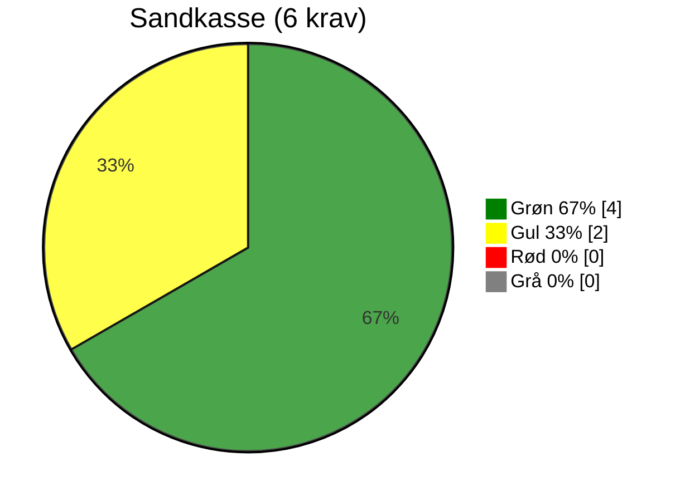
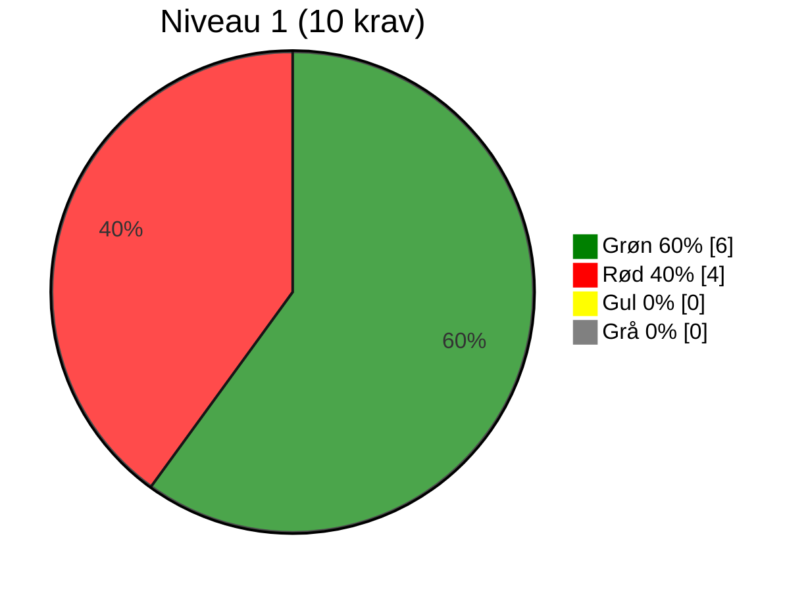
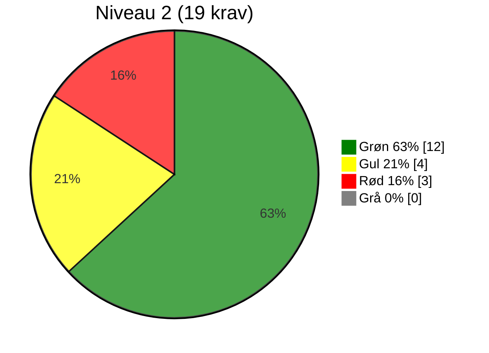
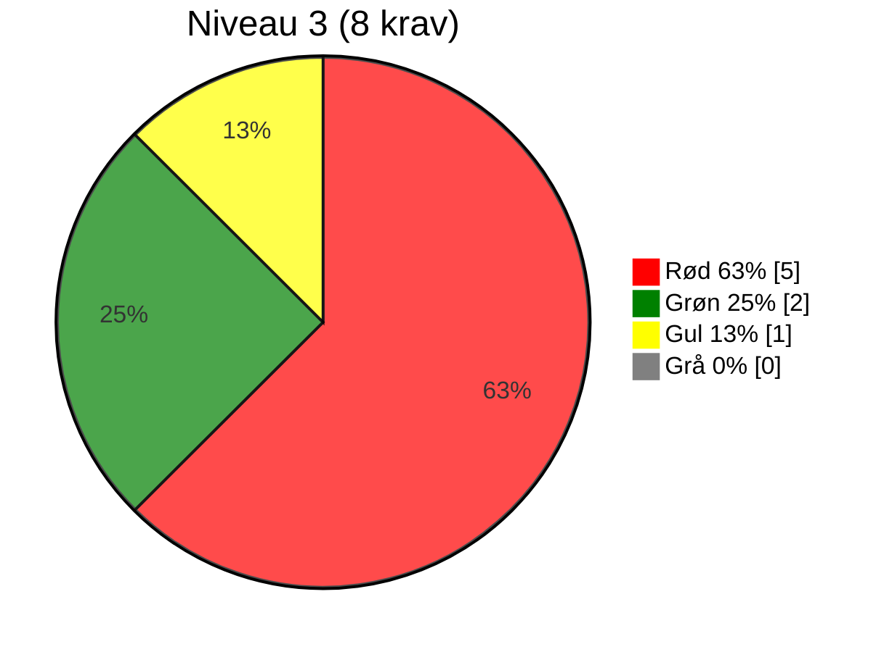
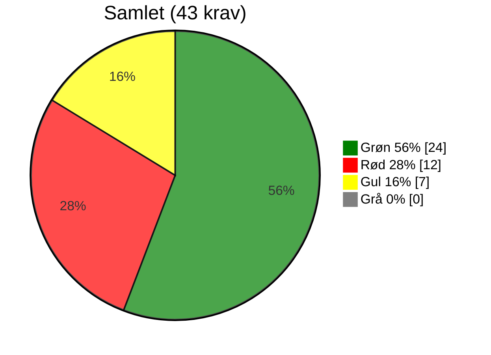

# Evaluering af OS2-produkt: OS2faktor

BEMÆRK AT EVALUERINGEN ER AUTOGENERERET. HVILKET BETYDER DEN ENDDNU IKKE ER ENDELIG

> **📄 Dokumentinformation** 
> **Version for anvendt evalueringsskabelon:** 0.9.2 
> **Dato for udfyldelse:** 01-07-2026 
> **Evaluering lavet af:** Autogenereret på baggrund af selvevaluering 
> **Link til Git organisation:** [indsæt link til git organisation/repo] 

## Resumé
Udfyldes senere.

## Overordnet vurdering
Udfyldes senere.

## Anbefaling
Udfyldes senere.

---

# Evaluering i henhold til krav i OS2s styringsmodel

## RELEVANS

| # | Niveau | Krav | Vurderingskriterie | Vurdering | Vurderingsgrundlag |
|-----|-----------|------|--------------------|-----------|--------------------|
| R1 | Sandkasse | Løsningen skaber lokal værdi | Standard: Produktet giver konkret og dokumenterbar værdi for den enkelte myndighed. | 🟢 | Værdibeskrivelse af OS2faktor OS2faktor giver organisationen en fælles og lokalt forankret platform for sikker adgang til digitale løsninger. Værdien ligger ikke alene i, at brugerne får multifaktor-login. Den væsentlige værdi er, at organisationen får bedre styring med identiteter, adgange, roller og sikkerhed på tværs af systemer. OS2faktor er derfor en strategisk byggeklods i kommunens digitale infrastruktur. Løsningen understøtter en mere ensartet, sikker og brugervenlig adgang til systemer, samtidig med at kommunen bevarer kontrol over egne adgangsmodeller og kan stille tydeligere krav til leverandører og integrationer. Ledelsesmæssig kerneværdi OS2faktor bidrager til, at organisationen kan arbejde mere sikkert, mere ensartet og mere effektivt med digital adgang. I praksis betyder det, at brugere kan få adgang via single sign-on, at adgang kan beskyttes med multifaktorautentificering, og at systemer kan modtage relevante oplysninger om brugerens identitet, organisatoriske placering og roller. Økonomisk værdi Den økonomiske værdi ved OS2faktor ligger især i at reducere kompleksitet, dobbeltarbejde og afhængighed af enkeltstående løsninger. Når flere systemer kan kobles til en fælles identitetsplatform, reduceres behovet for lokale brugerkonti, særskilte loginløsninger og manuelle adgangsprocesser i hvert enkelt system. Det giver mindre administration, færre fejl og mere genbrug af eksisterende integrationsmønstre. OS2faktor kan samtidig reducere omkostninger forbundet med sikkerhedshændelser. Stærkere adgangskontrol, multifaktorautentificering og bedre styring af brugeradgange mindsker risikoen for kompromitterede konti, uautoriseret adgang og efterfølgende driftsforstyrrelser. Det er ofte på dette område, den største økonomiske gevinst ligger: ikke som en direkte besparelse på én konto, men som reduceret risiko, mindre manuel håndtering og færre følgeomkostninger ved fejl eller hændelser. Derudover styrker løsningen kommunens forhandlings- og styringsposition over for leverandører. Når kommunen har en fælles og moden adgangsplatform, kan nye løsninger i højere grad tilsluttes kommunens eksisterende standarder for login, roller og sikkerhed i stedet for at etablere nye særskilte adgangsmodeller. Organisatorisk værdi Organisatorisk giver OS2faktor en mere sammenhængende og professionel adgangsstyring. Det bliver nemmere at beskrive, hvem der har ansvar for brugeradgang, hvilke roller der giver adgang til hvilke systemer, og hvordan adgang etableres, ændres og afsluttes. For medarbejderne giver løsningen en mere enkel brugeroplevelse. Single sign-on og fælles login reducerer friktion i hverdagen, mens multifaktorautentificering øger sikkerheden uden at hvert enkelt fagsystem skal opfinde sin egen metode. For IT og sikkerhedsorganisationen giver OS2faktor bedre mulighed for standardisering. Adgang kan i højere grad styres efter fælles principper, og integrationer kan baseres på kendte standarder som SAML, OpenID Connect og PKCE. Det gør løsningen mere robust og mindre afhængig af specialtilpasninger. For fagområderne betyder det, at digitalisering kan ske på et mere sikkert fundament. Nye løsninger kan kobles på en fælles adgangsmodel, og organisationen kan i højere grad sikre, at adgang følger medarbejderens organisatoriske tilknytning og rolle. Sikkerheds- og complianceværdi OS2faktor understøtter en mere kontrolleret adgang til kommunens net- og informationssystemer. Løsningen styrker arbejdet med multifaktorautentificering, adgangskontrol og dokumenterbare sikkerhedsforanstaltninger, som er centrale elementer i både NIS2, ISO27001/27002 og kommunens generelle modenhedsarbejde på informationssikkerhedsområdet. Ved at samle adgangsstyringen ét sted bliver det lettere at håndhæve fælles krav til login, sessioner, brugerstatus og adgangsniveau. Det reducerer risikoen for lokale undtagelser, skyggebrugere og adgangsmodeller, der ikke længere er tidssvarende. Samtidig giver løsningen bedre sporbarhed og bedre grundlag for hændelseshåndtering. Når adgangsveje og autentifikation er standardiseret, bliver det lettere at opdage, undersøge og reagere på mistænkelig aktivitet. Strategisk betydning OS2faktor bør ses som en fælles digital infrastrukturkomponent på linje med netværk, klientstyring og sikkerhedsovervågning. Det er en løsning, der gør det muligt at løfte sikkerheden uden at gøre digitaliseringen unødigt tung. Den strategiske værdi er, at kommunen får en adgangsplatform, der både kan understøtte den daglige drift, nye digitale løsninger, lokale integrationer og fremtidige krav til sikkerhed og compliance. OS2faktor giver dermed organisationen tre centrale gevinster: 1.	Bedre sikkerhed gennem stærkere og mere ensartet adgangskontrol. 2.	Bedre drift gennem færre manuelle adgangsprocesser og mindre kompleksitet. 3.	Bedre styring gennem fælles standarder, tydeligere ansvar og mere dokumenterbar compliance. Samlet set er OS2faktor ikke kun en teknisk loginløsning. Det er et organisatorisk styringsværktøj, der hjælper kommunen med at skabe sikker, effektiv og fremtidssikret digital adgang. |
| R2 | 2 | Løsningen er accepteret af lokal linjeledelse | Standard: Linjeledelsen har bakket op om deltagelsen i udviklingen og anvendelsen. | 🟢 | Der er en stor tilslutning til OS2faktor udviklingsfællesskab. Baseret på dette er der en accept af OS2faktor i den lokale ledelse |
| R3 | 2 | Løsningen har fælles offentligt potentiale | Standard: Kan skabe værdi og genbruges på tværs af myndigheder. | 🟢 | Løsningen har som standard snitflade til FK adgangsstyring, STIL og andre fælles offentlige adgangskomponenter. Løsningen følger DIGST SAML vejledning. Løsningen sikre en god integration og login oplevelse for brugerne til MitID Erhverv |
| R4 | 3 | Ophæng til nationale strategier er til stede | Standard: Understøtter fx digitaliseringsstrategi og fællesoffentlige mål. | 🟢 | OS2faktor understøtter "Strategi for brugerstyring" https://arkitektur.digst.dk/sites/default/fileuploads/Referencearkitekturer/RA_brugerstyring/v1.1/Strategi_for_brugerstyring_pdfa.pdf OS2faktor er den kommunale indgang til understøttelse af  eIDAS-forordningen, NSIS-standarden |

## FORMKRAV

| # | Niveau | Krav | Vurderingskriterie | Vurdering | Vurderingsgrundlag |
|------|-----------|------|--------------------|-----------|--------------------|
| F1 | Sandkasse | Kildekode til projektet udvikles synligt og aktivt i et OS2-repositorie | Standard: Kodebasen er tilgængelig og udvikles åbent på GitHub i OS2-kontrolleret organisation. | 🟢 | https://github.com/OS2faktor |
| F2 | Sandkasse | Open Source-licenskriterier overholdes | Standard: Godkendt Open Source Licens (fx MPL-2.0) er tydeligt angivet og anvendt. | 🟢 | https://github.com/OS2faktor/OS2faktor-Login/blob/master/LICENSE |
| F3 | Sandkasse | Udbudsregler og almindelig lovformlighed er overholdt | Standard: Projektet følger udbudsregler og gældende lovgivning. | 🟡 | Der bør udarbejdes et forklaringsnotat på hvornår der skal laves udbud |
| F4 | Sandkasse | Der er tænkt på sikkerheden i løsningen | Standard: Der forefindes dokumenteret sikkerhedsarbejde og/eller procedurer. | 🟢 | Løsningens udvikling er baseret på security-by-design, og tilhørende er der udarbejdet revision af hhv udviklingsprocesser og drift af løsningen. |
| F5 | Sandkasse | Løsningens formål og værdi er beskrevet | Standard: Formål og værdi er klart beskrevet, gerne i en README tilknyttet kodebasen. | 🟡 | Ingen data i selvevalueringsrapport. |
| F6 | 1 | Kildekoden er overdraget og placeret under OS2's GitHub | Standard: Koden er juridisk overdraget og hostes under OS2's GitHub. | 🟢 | https://github.com/OS2faktor |
| F7 | 1 | Dokumentation udarbejdes med og overholder OS2's standardskabelon | Standard: Dokumentation i åbent format (fx Markdown) og OS2’s skabelon anvendt. | 🔴 | Findes som word og pdf dokumenter |
| F10 | 1 | OS2's kommunikationskanaler anvendes | Standard: Information findes på os2.eu. | 🟢 | Meget lidt... |
| F11 | 1 | Offentlig issue-tracking anvendes | Standard: Opgaver (issues) og kodeændringer spores offentligt og tilknyttes GitHub. | 🔴 | Der anvendes OS2's jira som issue tracker, men kodestyringen kører ikke med reference til OS2s jira |
| F12 | 2 | Kun én version af core-koden (master) | Standard: Ingen parallelle versioner af kodebasen. | 🟢 | Ingen data i selvevalueringsrapport. |
| F13 | 2 | Præsentationsmateriale af løsningen er udarbejdet | Standard: Der findes præsentationer om produktet. | 🟢 | https://www.os2faktor.dk |
| F14 | 2 | Kommunikationsmateriale til strategisk niveau | Standard: Der findes materialer målrettet ledelse og strategi. | 🟢 | https://www.os2faktor.dk/documentation/OS2faktor%20Login%20Whitepaper.pdf |
| F15 | 2 | Best practice for implementering i organisationen dokumenteres | Standard: Vejledninger og erfaringer er beskrevet. | 🟢 | https://www.os2faktor.dk/docs.html |
| F16 | 2 | Teknisk dokumentation indeholder best practice for kodestandarder | Standard: Kodestandarder dokumenteret, relevant dokumentation til udviklere. | 🟡 | Ingen data i selvevalueringsrapport. |
| F17 | 2 | Drifts- og vedligeholdelsessetup er beskrevet | Standard: Driftmiljø og procedurer for vedligehold beskrevet. | 🟡 | Ingen data i selvevalueringsrapport. |
| F18 | 2 | Rammearkitektur og standarder er fulgt og afvigelser forklaret | Standard: Overensstemmelse med rammearkitektur er beskrevet. | 🟢 | Ingen data i selvevalueringsrapport. |
| F19 | 2 | Løsningen leveret i containerformat | Standard: Fx Docker anvendes. | 🟢 | Ingen data i selvevalueringsrapport. |
| F20 | 2 | Uddannelsesmateriale er udarbejdet | Standard: Undervisningsmaterialer findes. | 🟢 | https://www.os2faktor.dk/docs.html  -  men måske kigge på en adminsitrator-brugervejledning |
| F21 | 3 | Politisk kommunikation er udarbejdet | Standard: Materialer målrettet politikere og offentlighed er udarbejdet. | 🔴 | Ingen data i selvevalueringsrapport. |
| F22 | 3 | Procesplan og procesansvar for drift er udarbejdet | Standard: Dokumenteret proces og ansvar ifm. idriftsættelse. | 🟡 | Ingen data i selvevalueringsrapport. |

## STRATEGISK SAMMENHÆNG

| # | Niveau | Krav | Vurderingskriterie | Vurdering | Vurderingsgrundlag |
|-----|-----------|------|--------------------|-----------|--------------------|
| S1 | 1 | Produktet har kobling til OS2's strategi | Standard: Understøtter OS2’s mission og vision. | 🔴 | Ingen data i selvevalueringsrapport. |
| S2 | 1 | Løsningen understøtter innovation og open source | Standard: Fremmer innovation og åbenhed. | 🔴 | Ingen data i selvevalueringsrapport. |
| S3 | 2 | Kobling til OS2's mission, vision og strategi er beskrevet | Standard: Forbindelsen er beskrevet. | 🔴 | Ingen data i selvevalueringsrapport. |
| S4 | 2 | Vision og strategi for produktet er udarbejdet | Standard: Der findes en formel vision og strategi for produktet. | 🔴 | Ingen data i selvevalueringsrapport. |
| S5 | 3 | Produktets overensstemmelse med OS2's vision og strategi | Standard: Tydelig sammenhæng og beskrivelse. | 🔴 | Ingen data i selvevalueringsrapport. |

## GOVERNANCE

| # | Niveau | Krav | Vurderingskriterie | Vurdering | Vurderingsgrundlag |
|------|-----------|------|--------------------|-----------|--------------------|
| G1 | 1 | Produktet er oprettet i OS2's porteføljestyring | Standard: Findes i OS2’s porteføljedatabase, hjemmeside og årshjul. | 🟢 | Ingen data i selvevalueringsrapport. |
| G2 | 1 | Der koordineres løbende med OS2-sekretariatet | Standard: Der er løbende kontakt med sekretariatet. | 🟢 | Ingen data i selvevalueringsrapport. |
| G3 | 1 | Projektleder/tovholder er udpeget | Standard: Der er udpeget en fast kontaktperson/koordinator. | 🟢 | Ingen data i selvevalueringsrapport. |
| G4 | 1 | Bestyrelsen er orienteret | Standard: Bestyrelsen kender til projektet. | 🟢 | Ingen data i selvevalueringsrapport. |
| G5 | 2 | Bestyrelsen har godkendt produktet | Standard: Formelt godkendt i referater. | 🟢 | Ingen data i selvevalueringsrapport. |
| G6 | 2 | Der er nedsat en styregruppe | Standard: Der findes en aktiv styregruppe. | 🟡 | Ingen data i selvevalueringsrapport. |
| G7 | 2 | Der er nedsat en koordinationsgruppe | Standard: Der findes en aktiv koordinationsgruppe. | 🟢 | Ingen data i selvevalueringsrapport. |
| G8 | 2 | Projektmodel anvendes og dokumenteret (anbefaling) | Standard: Der arbejdes efter en dokumenteret projektmodel. | 🟡 | Har vi noget? |
| G9 | 2 | Review af kode foretages af tredjepart (anbefaling) | Standard: Uafhængig kodegennemgang gennemføres og procedure er beskrevet. | 🔴 | Ingen data i selvevalueringsrapport. |
| G10 | 2 | Tilslutningserklæring til sikring af økonomi (anbefaling) | Standard: OS2-tilslutningsaftale findes og er effektueret. | 🟢 | Ingen data i selvevalueringsrapport. |
| G11 | 3 | Bestyrelsen har godkendt styregruppen | Standard: Formelt godkendt i referater. | 🔴 | Ingen data i selvevalueringsrapport. |
| G12 | 3 | Bestyrelsen er repræsenteret i styregruppen | Standard: Bestyrelsesmedlem deltager. | 🔴 | Ingen data i selvevalueringsrapport. |
| G13 | 3 | Aftale sikrer økonomi til koordinering og videreudvikling | Standard: Aftaler om finansiering er på plads og budget udarbejdet. | 🟢 | Ingen data i selvevalueringsrapport. |
| G14 | 3 | Fagligt fællesskab bag løsningen | Standard: Aktivt fællesskab, fx brugerklub, forum eller andet netværk. | 🔴 | Ingen data i selvevalueringsrapport. |

# Optælling af vurderinger pr. niveau og tema

| Niveau / Vurdering | 🟢 Grøn | 🟡 Gul | 🔴 Rød | ⚪ Grå |
|-------------------------|---------|--------|--------|--------|
| Sandkasse | 4 | 2 | 0 | 0 |
| Niveau 1 | 6 | 0 | 4 | 0 |
| Niveau 2 | 12 | 4 | 3 | 0 |
| Niveau 3 | 2 | 1 | 5 | 0 |
| **Total** | 24 | 7 | 12 | 0 |

| Tema / Niveau | Sandkasse | Niveau 1 | Niveau 2 | Niveau 3 | Total |
|---|---|---|---|---|---|
| Relevans | 🟢 1 🟡 0 🔴 0 ⚪ 0 | 🟢 0 🟡 0 🔴 0 ⚪ 0 | 🟢 2 🟡 0 🔴 0 ⚪ 0 | 🟢 1 🟡 0 🔴 0 ⚪ 0 | 🟢 4 🟡 0 🔴 0 ⚪ 0 |
| Formkrav | 🟢 3 🟡 2 🔴 0 ⚪ 0 | 🟢 2 🟡 0 🔴 2 ⚪ 0 | 🟢 7 🟡 2 🔴 0 ⚪ 0 | 🟢 0 🟡 1 🔴 1 ⚪ 0 | 🟢 12 🟡 5 🔴 3 ⚪ 0 |
| Strategisk sammenhæng | 🟢 0 🟡 0 🔴 0 ⚪ 0 | 🟢 0 🟡 0 🔴 2 ⚪ 0 | 🟢 0 🟡 0 🔴 2 ⚪ 0 | 🟢 0 🟡 0 🔴 1 ⚪ 0 | 🟢 0 🟡 0 🔴 5 ⚪ 0 |
| Governance | 🟢 0 🟡 0 🔴 0 ⚪ 0 | 🟢 4 🟡 0 🔴 0 ⚪ 0 | 🟢 3 🟡 2 🔴 1 ⚪ 0 | 🟢 1 🟡 0 🔴 3 ⚪ 0 | 🟢 8 🟡 2 🔴 4 ⚪ 0 |

## Hvad betyder trafiklysene?
- 🟢 **Grøn** → Kravet er fuldt opfyldt og fungerer som forventet.
- 🟡 **Gul** → Kravet er planlagt eller delvist opfyldt, men der er mangler, som bør adresseres.
- 🔴 **Rød** → Kravet er ikke opfyldt, ukendt eller der er behov for handling.
- ⚪ **Grå** → Kravet er ikke relevant og medtages ikke i vurderingen.

## Hvordan bruges optællingen?

- **Sandkasse:** Grundlæggende formalia – mange 🔴 her betyder, at produktet skal løftes bare for at blive betragtet som OS2-kompatibelt.
- **Niveau 1:** Basis governance og dokumentation – – mange 🟡 eller 🔴 her peger på udfordringer med at skabe overblik og ejerskab.
- **Niveau 2:** Drift, vedligehold og strategisk understøttelse – mange 🟡 eller 🔴 her peger på modenhedsproblemer.
- **Niveau 3:** Avanceret governance og fællesskab – et område, hvor ikke alle produkter nødvendigvis når i mål, men som er ønskværdigt for stabile og bæredygtige produkter.

Ud fra optællingen kan vi vurdere, hvor produktet står samlet set:

- Mange 🟢 → Produktet er solidt forankret i governance-kravene.
- Mange 🟡 → Produktet har et godt grundlag, men kræver en prioriteret indsats på udvalgte områder.
- Mange 🔴 → Produktet har alvorlige governance-mangler og kræver en struktureret genopretning.
- Mange ⚪ → Produktet har alvorlige mangler i forhold til OS2 kompatabilitet og kræver et særligt fokus.

## Hvor mange krav er der?

### Antal krav fordelt på tema
* Relevans: *4 krav* (R1–R4)
* Formkrav: *20 krav* (F1–F22, minus F8 og F9 som er sammenlagt med F7)
* Strategisk sammenhæng: *5 krav* (S1–S5)
* Governance: *14 krav* (G1–G14)
* *I alt: 43 krav*

### Antal krav fordelt på niveau

Bemærk at der nedarves så et niveau 2 produkt skal også efterleve sandkasse og niveau 2.

* Sandkasse: *6 krav*
* Niveau 1: *10 krav* (16 i alt)
* Niveau 2: *19 krav* (35 i alt)
* Niveau 3: *8 krav* (43 i alt)
* *I alt: 43 krav*