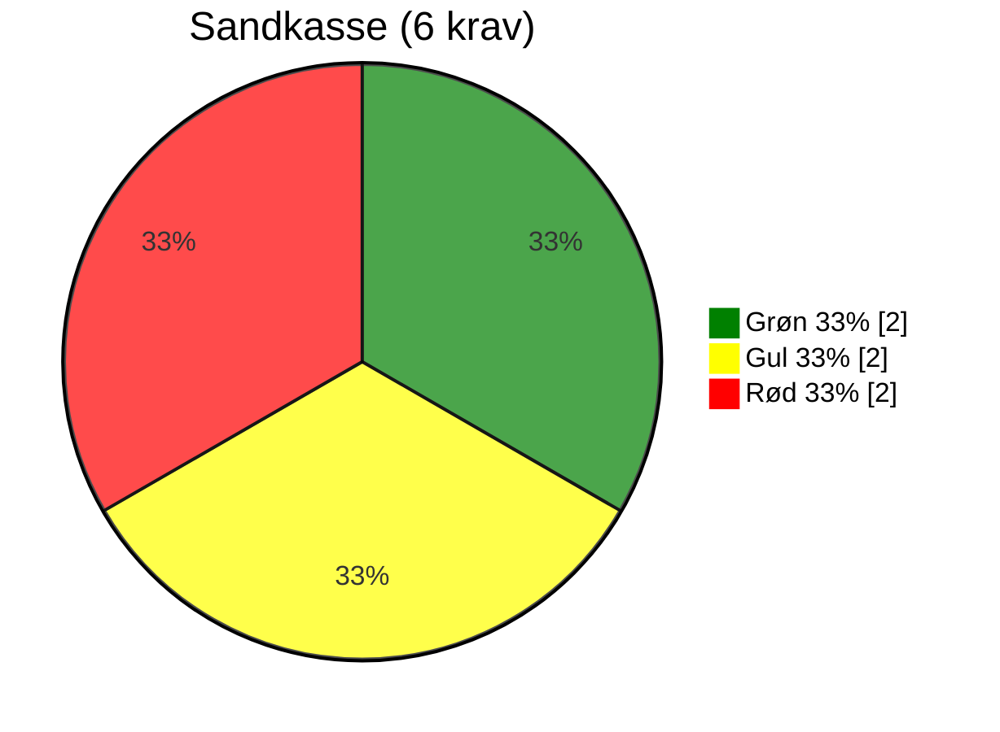
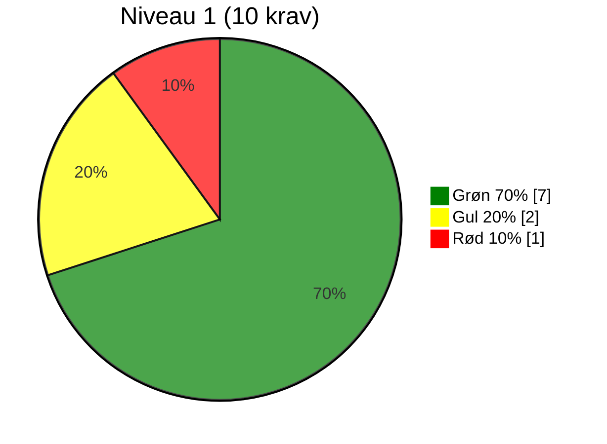
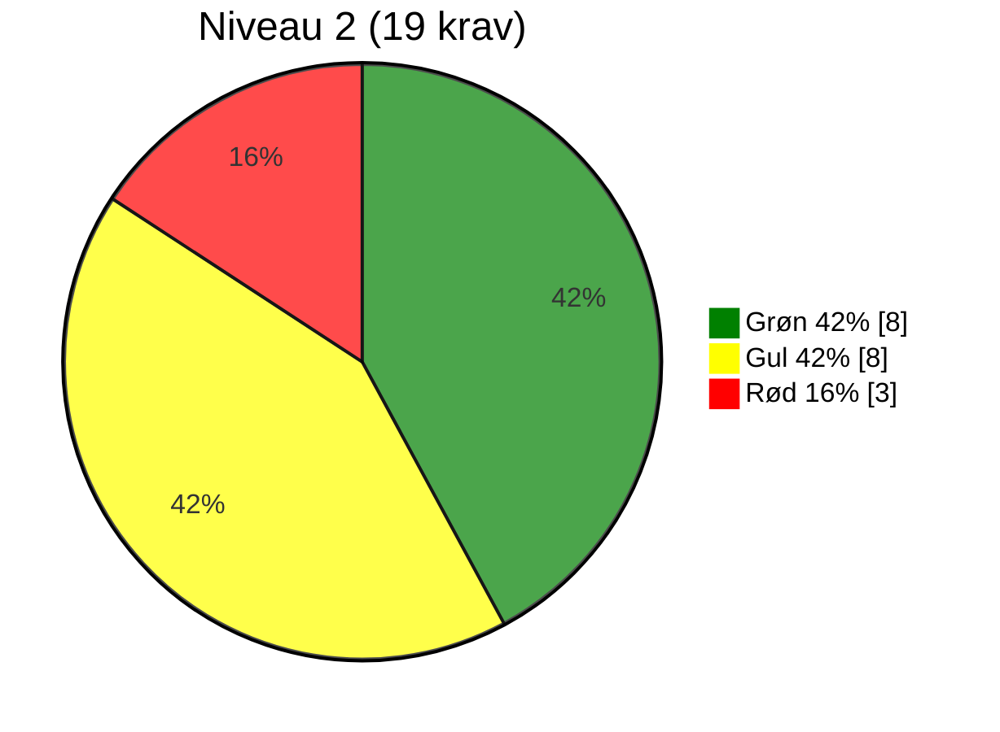
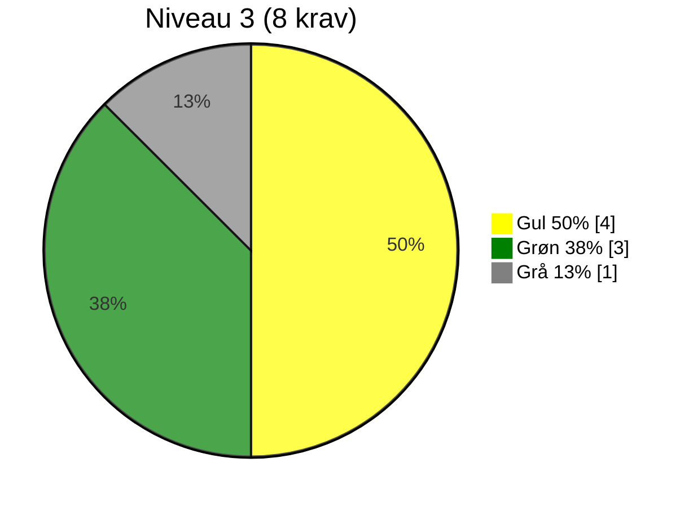
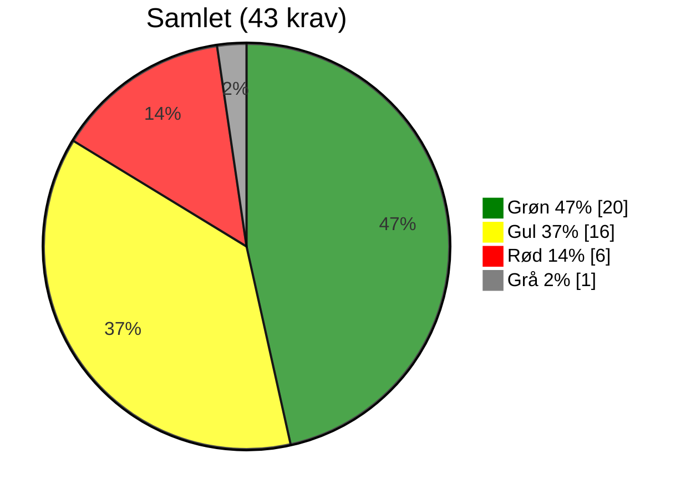

# Evaluering af OS2rollekatalog

> **📄 Dokumentinformation** 
**Version for anvendt governancerapport:** 1.1.0 
**Dato for udfyldelse:** 2026-09-29 
**Udfyldt af:** Rasmus Frey, Sekretariatschef OS2-sekretariatet 
**Link til Git organisation:** <https://github.com/os2rollekatalog> 
**Seneste selvevaluering/governanceraport:** [Se governancerapporten](../selvevaluering/2026-07-02-OS2rollekatalog-governancerapport) 
**Status:** Fremsendt til produktforvaltningen for OS2rollekatalog

## Resumé

OS2rollekatalog fremstår som et veletableret og organisatorisk modent OS2-produkt med bred anvendelse, en stabil finansieringsmodel, etableret styring og et aktivt produktfællesskab.

Evalueringen viser samtidig en række områder, hvor praksis og dokumentation bør styrkes. Det gælder særligt teknisk dokumentation, sikkerhed, transparens i udviklingsprocessen, strategisk sammenhæng samt dokumentation for enkelte formelle beslutninger og aftaler.

Samlet er 20 af 43 krav vurderet grønne, 16 gule, 6 røde og 1 gråt. En væsentlig del af de gule vurderinger skyldes, at eksisterende praksis eller dokumentation ikke er tilstrækkeligt beskrevet eller gjort tilgængelig til, at efterlevelsen kan verificeres.

Evalueringen skal ses som et løbende styringsredskab og et fælles grundlag for dialog om produktets modenhed, prioriteringer og videre udvikling. Formålet er ikke, at produktet på et bestemt tidspunkt skal have alle krav vurderet grønne, men at styregruppen aktivt forholder sig til de identificerede forbedringsområder, prioriterer dem og synliggør den planlagte opfølgning som en del af den almindelige produktforvaltning.

På baggrund af den samlede evaluering anbefaler sekretariatet, at OS2rollekatalog placeres på produktniveau 2. Produktet har en modenhed, organisering og udbredelse, der klart rækker ud over niveau 1, mens der fortsat er forbedringsområder, særligt inden for dokumentation, teknisk praksis og strategisk styring, som bør arbejdes videre med, før en eventuel placering på niveau 3 er mulig.

## Overordnet vurdering

OS2rollekatalog har et solidt organisatorisk fundament. Produktet anvendes bredt på tværs af offentlige myndigheder og har etableret produktkoordinator, styregruppe, koordinationsgruppe, finansieringsmodel og et aktivt fagligt fællesskab. Governanceområdet er derfor samlet set en væsentlig styrke.

De største forbedringsbehov findes under formkravene. Flere relevante dokumenter og processer oplyses at eksistere, men er ikke offentligt tilgængelige eller direkte dokumenteret i evalueringen. Det gælder blandt andet sikkerhed, drift, implementering, arkitektur og teknisk dokumentation. Der er samtidig enkelte områder, hvor selve praksis bør styrkes, herunder synlig udvikling i det officielle repository, offentlig issue tracking, dokumentation af kodestandarder samt indkøbs- og leverandørforhold.

Produktets strategiske sammenhæng med OS2 vurderes grundlæggende at være til stede, men er ikke tilstrækkeligt dokumenteret. Der mangler desuden en tydelig produktvision og strategiske mål, som kan bruges til at prioritere produktets videre udvikling.

Evalueringen skal ikke forstås som en eksamen, revision eller certificering, som produktet skal bestå på et bestemt tidspunkt. Den er et styringsredskab, der skal give produktfællesskabet, sekretariatet og bestyrelsen et fælles billede af produktets aktuelle modenhed og de områder, hvor der er mulighed eller behov for forbedring.

Gule og røde vurderinger er derfor ikke i sig selv udtryk for, at produktet ikke fungerer eller ikke kan være en del af OS2. De synliggør forhold, som produktforvaltningen bør forholde sig til og prioritere i forhold til produktets risici, behov og udviklingsretning.

Det forventes, at styregruppen anvender evalueringen aktivt i den løbende produktforvaltning og holder den opdateret, efterhånden som praksis, dokumentation og organisering udvikler sig.

## Anbefalinger

### Anbefaling til produktforvaltningen

Det anbefales, at styregruppen anvender evalueringen som et fast styringsredskab i den løbende forvaltning.

Sekretariatet fastsætter ikke en generel tidsfrist for, hvornår alle gule og røde vurderinger skal være ændret til grønne. Det er styregruppens ansvar at vurdere, hvilke forbedringer der er vigtigst for produktet, hvordan de skal prioriteres, og hvornår de realistisk kan gennemføres.

Sekretariatet forventer dog, at produktforvaltningen:

- Tager stilling til de identificerede forbedringsområder
- Prioriterer dem ud fra risiko, værdi og ressourcer
- Udarbejder en realistisk plan for det videre arbejde
- Synliggør planlagte aktiviteter og prioriteringer
- Løbende opdaterer evalueringen, når dokumentation eller praksis ændres.

Planen kan med fordel indgå i produktets eksisterende roadmap, årshjul eller issue tracker frem for at blive etableret som et særskilt kontrolspor.

Evalueringen bør således indgå som en del af den almindelige ledelse og udvikling af produktet og anvendes løbende i dialogen mellem styregruppen, produktforvaltningen og OS2-sekretariatet.

Der bør særligt arbejdes med:

1. At samle, vedligeholde og gøre central produktdokumentation let tilgængelig
2. At styrke transparens og sporbarhed i udviklingsprocessen
3. At dokumentere sikkerhedsarbejde, teknisk kvalitet og sårbarhedshåndtering
4. At sikre et tydeligt aftale- og rettighedsgrundlag omkring kode og leverandører
5. At udarbejde en tydelig produktvision, strategiske mål og afgrænsning af produktets kerne
6. At konkretisere produktets sammenhæng med OS2's mission, vision og strategi
7. At få dokumenteret eller formaliseret de forhold, hvor dokumentationen i dag er utilstrækkelig.

### Anbefaling til OS2's bestyrelse om produktniveau

Sekretariatet anbefaler, at OS2rollekatalog placeres på produktniveau 2.

Anbefalingen bygger på, at produktet har en modenhed og et omfang, der ligger over niveau 1:

- Produktet anvendes bredt på tværs af offentlige myndigheder
- Der er etableret en fast styregruppe og koordinationsgruppe
- Produktet har en bæredygtig og løbende finansiering
- Der er en etableret produktforvaltning
- Der findes et aktivt fagligt fællesskab omkring produktet
- Der er en fælles kerne og en etableret drifts- og vedligeholdelsespraksis.

Placeringen på niveau 2 forudsætter ikke, at alle krav allerede er grønne. Niveauplaceringen skal afspejle produktets samlede modenhed, betydning og styringsbehov, mens evalueringen bruges til at synliggøre og følge de områder, hvor produktet fortsat bør udvikle sig.

Sekretariatet anbefaler ikke placering på niveau 3 på nuværende tidspunkt. Selvom OS2rollekatalog allerede efterlever flere niveau 3-krav, er den strategiske retning og sammenhæng endnu ikke tilstrækkeligt dokumenteret og flere underliggende krav har fortsat væsentlige forbedringsbehov.

Produktniveau 2 vurderes derfor at være den mest retvisende placering af produktets aktuelle modenhed.

Bestyrelsen anbefales samtidig at forvente, at styregruppen anvender evalueringen aktivt, udarbejder en synlig plan for de væsentligste forbedringsområder og løbende opdaterer evalueringen som en del af den almindelige produktstyring.

---

# Evalueringen

## Hvad betyder trafiklysene?

- 🟢 **Grøn** → Kravet er fuldt opfyldt og fungerer som forventet.
- 🟡 **Gul** → Kravet er delvist opfyldt, men der er mangler, som bør adresseres.
- 🔴 **Rød** → Kravet er ikke opfyldt, og der er behov for handling.
- ⚪ **Grå** → Kravet er vurderet som ikke relevant og medtages ikke i vurderingen.

## RELEVANS

| \#  | Krav                                          | Produktniveau | Retningslinjer                                                                                                        | Efterlevet? | Dokumentation                                                                                                                                                                                                                                                                                                                                        | Vurdering | Vurderingsgrundlag                                                        | Anbefaling                                                                                                                                                                                                                                                                                                                                                                                                                                                                                                                                                                                                                                                                                                                                                                                                                                     |
|----|-----------------------------------------------|---------------|-----------------------------------------------------------------------------------------------------------------------|-------------|------------------------------------------------------------------------------------------------------------------------------------------------------------------------------------------------------------------------------------------------------------------------------------------------------------------------------------------------------|-----------|---------------------------------------------------------------------------|------------------------------------------------------------------------------------------------------------------------------------------------------------------------------------------------------------------------------------------------------------------------------------------------------------------------------------------------------------------------------------------------------------------------------------------------------------------------------------------------------------------------------------------------------------------------------------------------------------------------------------------------------------------------------------------------------------------------------------------------------------------------------------------------------------------------------------------------|
| R1 | Løsningen skaber lokal værdi                  | sandkasse     | Beskriv den konkrete værdi løsningen skaber i organisationen. F.eks. økonomisk, organisatorisk eller brugerrelateret. | Ja          | Løsningen sikrer at medarbejdere og ledere får de rigtige roller og rettigheder til organisationens it-systemer. Dette har stor værdi for den enkelte organisation, fx. en kommune, og sikrer overholdelse af krav fra revision i forhold til dokumentation af hvilke medarbejdere, der har adgang til hvilke it-systemer og hvad de har adgang til. | 🟢        | Løsningen har beskrevet og bevist sin værdi.                              | Produktfællesskabet kunne overveje at udarbejde et gevinstrealiseringskort eller en businesscase som beskriver værdien.                                                                                                                                                                                                                                                                                                                                                                                                                                                                                                                                                                                                                                                                                                                        |
| R2 | Løsningen er accepteret af lokal linjeledelse | 2             | Beskriv eller henvis til en formel accept fra ledelse hos initiativtagerne til løsningen.                             | Ja          | Den enkelte kommune eller anden organisation, der anvender løsningen, underskriver tilslutningsdokument til OS2 generelt og til OS2rollekatalog når de skal tage OS2rollekatalog i brug.                                                                                                                                                             | 🟢        | Tilslutningsaftalen udgør formel accept fra lokale linjeledelse.          |                                                                                                                                                                                                                                                                                                                                                                                                                                                                                                                                                                                                                                                                                                                                                                                                                                                |
| R3 | Løsningen har fælles offentligt potentiale    | 2             | Redegør for hvordan løsningen kan bruges på tværs af kommuner og/eller offentlige myndigheder.                        | Ja          | 52 kommuner og Datatilsynet anvender produktet aktivt.                                                                                                                                                                                                                                                                                               | 🟢        | Antallet af myndigheder beviser en fællesoffentligt anvendelse.           | Produktfællesskabet kan med fordel beskrive at løsningen adresserer et behov, som findes hos flere offentlige myndigheder og at løsningen kan anvendes på tværs uden væsentlig lokal specialtilpasning.                                                                                                                                                                                                                                                                                                                                                                                                                                                                                                                                                                                                                                        |
| R4 | Ophæng til nationale strategier er til stede  | 3             | Henvis til relevante strategier og forklar hvordan løsningen understøtter disse.                                      | Ja          | Løsninger er meget stabil og sikker og understøtter strategier om at arbejde henimod øget digital suverænitet, fx. KL's digitaliseringsstrategi 2026-2030. <https://www.kl.dk/oekonomi-og-administration/digitalisering-og-teknologi/politik-og-strategi/kommunernes-digitaliseringsstrategi-2026-2030#oeg-digital-sikkerhed-og-sammenhaeng-1c>        | 🟡        | Der mangler dokumentation for at det beskrevne rent faktisk er tilfældet. | Henvisningen til KL's digitaliseringsstrategi er relevant, men sammenhængen mellem strategien og løsningen bør dokumenteres tydeligere.  Beskriv gerne: Hvilket konkret mål eller hvilken ambition i strategien løsningen understøtter. Hvilke konkrete egenskaber ved løsningen der bidrager til dette og hvor dette er dokumenteret.   Hvis løsningen eksempelvis vurderes at bidrage til øget digital suverænitet, bør det beskrives, hvordan den gør det. Det kan f.eks. være gennem open source, leverandøruafhængighed, ejerskab til kode og data, åbne standarder, mulighed for selvstændigt valg af drift eller andre konkrete forhold.  Påstanden om, at løsningen er stabil og sikker, bør tilsvarende underbygges med relevant dokumentation, hvis den bruges som argument for strategisk sammenhæng. |
|    |                                               |               |                                                                                                                       |             |                                                                                                                                                                                                                                                                                                                                                      |           |                                                                           |                                                                                                                                                                                                                                                                                                                                                                                                                                                                                                                                                                                                                                                                                                                                                                                                                                                |

## FORMKRAV

| \#   | Krav                                                                                                            | Produktniveau | Retningslinjer                                                                                                                                                                                                                                                                                                        | Efterlevet?   | Dokumentation                                                                                                                                                                                                                                                                                                                  | Vurdering | Vurderingsgrundlag                                                                                                                                                                                                                                                                                                                                                                                                                                                                                                                                                                                                                                                                                                            | Anbefaling                                                                                                                                                                                                                                                                                                                                                                                                                                                                                                                                                                                                                                                                                                                                                                                                                                                                                                                                                                                                                                                                                                                                                                                                                    |
|-----|-----------------------------------------------------------------------------------------------------------------|---------------|-----------------------------------------------------------------------------------------------------------------------------------------------------------------------------------------------------------------------------------------------------------------------------------------------------------------------|---------------|--------------------------------------------------------------------------------------------------------------------------------------------------------------------------------------------------------------------------------------------------------------------------------------------------------------------------------|-----------|-------------------------------------------------------------------------------------------------------------------------------------------------------------------------------------------------------------------------------------------------------------------------------------------------------------------------------------------------------------------------------------------------------------------------------------------------------------------------------------------------------------------------------------------------------------------------------------------------------------------------------------------------------------------------------------------------------------------------------|-------------------------------------------------------------------------------------------------------------------------------------------------------------------------------------------------------------------------------------------------------------------------------------------------------------------------------------------------------------------------------------------------------------------------------------------------------------------------------------------------------------------------------------------------------------------------------------------------------------------------------------------------------------------------------------------------------------------------------------------------------------------------------------------------------------------------------------------------------------------------------------------------------------------------------------------------------------------------------------------------------------------------------------------------------------------------------------------------------------------------------------------------------------------------------------------------------------------------------|
| F1  | Alt kildekode til projektet udvikles synligt og aktivt i et repositorie og versionskontrolsystem, anvist af OS2 | sandkasse     | Upload al kildekode i et offentligt OS2 repository med aktiv versionshistorik.                                                                                                                                                                                                                                        | Ja            | Kodebasen er tilgængelig og nye releases offentliggøres i GitHub for OS2rollekatalog, men udviklingen foregår et andet sted. Link til GitHub: <https://github.com/OS2rollekatalog>                                                                                                                                               | 🟡        | Det bekræftes, at kildekoden er offentligt tilgængelig i et OS2-repository.  Det fremgår dog samtidig, at den løbende udvikling foregår et andet sted, og at kode efterfølgende leveres til OS2-repositoriet i større kodeleverancer.   Det betyder, at udviklingshistorikken, de enkelte ændringer og sammenhængen mellem ændringsønsker og kode ikke er fuldt synlige i OS2's repository.                                                                                                                                                                                                                                                                                                               | Det anbefales at den aktive udvikling i højere grad foregår direkte i det fælles repository med løbende commits, branches og pull requests. Det vil øge transparens og sporbarhed og gøre det lettere for andre at forstå, reviewe, videreudvikle og overtage løsningen.  Som arbejdsform kan eksempelvis en Git-baseret branch- og pull request-proces anvendes.                                                                                                                                                                                                                                                                                                                                                                                                                                                                                                                                                                                                                                                                                                                                                                                                                                                   |
| F2  | Open Source licenskriterier overholdes                                                                          | sandkasse     | Angiv hvilken OSI-godkendt licens projektet bruger. OS2 standard er MPL 2.0                                                                                                                                                                                                                                           | Ja            | Synligt i GitHub. Softwaren OS2rollekatalog er frigivet på en godkendt licens.                                                                                                                                                                                                                                                 | 🟡        | Det bør dokumenteres konkret, hvilken open source-licens OS2rollekatalog er frigivet under.   Henvis direkte til licensfilen i det officielle repository og angiv  licensen eksplicit.                                                                                                                                                                                                                                                                                                                                                                                                                                                                                                                         | Det bør samtidig sikres, at licensen gælder for den samlede kodebase, og at anvendte biblioteker og øvrige softwarekomponenter har licenser, som er forenelige med distributionen af løsningen.  Det anbefales derfor at udarbejde og vedligeholde en SBOM (<https://github.com/resources/articles/what-is-an-sbom-software-bill-of-materials>), som giver overblik over løsningens komponenter og afhængigheder. SBOM'en bør suppleres med en licensgennemgang, så det kan dokumenteres, at tredjepartskomponenternes licensvilkår er kendte og overholdes.                                                                                                                                                                                                                                                                                                                                                                                                                                                                                                                                                                                                                                                          |
| F3  | Udbudsregler og alm. lovformelighed er overholdt                                                                | sandkasse     | Bekræft at udbudspligt er overholdt eller redegør for undtagelse. Vedlæg evt. beslutningsnotat.                                                                                                                                                                                                                       | Planlagt      | Der skal udarbejdes et forklaringsnotat og retningslinjer vedr. OS2 produkter. Det vil være hensigtsmæssigt at dette udarbejdes af OS2 sekretariatet, da der er brug for det for flere OS2 produkter.                                                                                                                          | 🔴        | Produktet har korrekt angivet kriteriet som planlagt og dermed identificeret, at dokumentationen endnu ikke er på plads.  OS2-sekretariatet kan udarbejde generel vejledning og skabeloner, men kan ikke på vegne af produktet redegøre for de konkrete indkøbsretlige forhold, da disse afhænger af produktets aftaler, indkøb og historik.  Det forventes derfor, at styregruppen for OS2rollekatalog selv kan redegøre for det konkrete grundlag for produktets indkøb og leverandøraftaler.                                                                                                                                                                                                           | Det anbefales, at OS2rollekatalog som planlagt får dokumenteret sin praksis for indkøb og leverandøraftaler og kan redegøre for grundlaget for, at disse er gennemført i overensstemmelse med gældende regler.  Dokumentationen kan f.eks. bestå af henvisning til aftalegrundlag, udbud, rammeaftale, kontrakt, indkøbsbeslutning eller et kort beslutningsnotat.  OS2-sekretariatet er i samarbejde med ekstern rådgiver ved at udarbejde en generel vejledning, som kan understøtte produktet i arbejdet: <https://github.com/OS2offdig/governance_report_template/issues/89>                                                                                                                                                                                                                                                                                                                                                                                                                                                                                                                                                                                                                            |
| F4  | Der er tænkt på sikkerheden i løsningen                                                                         | sandkasse     | Beskriv hvordan sikkerhed er indtænkt i design, kode og drift – f.eks. kryptering, adgangsstyring.                                                                                                                                                                                                                    | Ja            | Der er i høj grad tænkt på sikkerheden i løsningen. Der er brugervendt adgangsstyring, logning mv. Der er udarbejdet ISAE revisionsrapport, der beskriver driftsmiljøet. Der er udarbejdet en beskrivelse af sikkerheden på produktet fra leverandøren. Der kan fremsendes dokumentation, hvis nødvendigt.                     | 🔴        | Besvarelsen viser, at der er arbejdet med sikkerhed, men dokumentationen er for overordnet til at kunne efterprøve.  Der henvises til adgangsstyring, logning, en ISAE-revisionsrapport og en leverandørudarbejdet sikkerhedsbeskrivelse, men uden konkrete links eller dokumentation.  En ISAE-erklæring for et konkret driftsmiljø dokumenterer ikke nødvendigvis sikkerheden i selve produktets kodebase og udviklingsproces. Endvidere kan driftsaftaler i variere mellem de myndigheder, der anvender løsningen.  Produktets egen sikkerhedsdokumentation bør derfor i højere grad beskrive sikkerheden i kode, arkitektur og udviklingsproces samt den løbende håndtering af sårbarheder. | Sekretariatet medgiver at retningslinjer for kravet skal gøres tydeligere og har registreret et issue til formålet, <https://github.com/OS2offdig/governance_report_template/issues/90>.   Det anbefales, at OS2rollekatalog samler og offentliggør den centrale sikkerhedsdokumentation sammen med produktets kildekode. Dokumentationen bør som minimum beskrive:   - sikkerhedsmæssige principper i løsningens design og arkitektur.  - centrale mekanismer som adgangsstyring, autorisation, logning og beskyttelse af data.  - hvordan kode og afhængigheder løbende overvåges for kendte sårbarheder.  - hvordan sikkerhedsopdateringer vurderes, prioriteres og frigives.  - hvem der har ansvar for sikkerhed i produktforvaltningen.  - hvordan eksterne parter kan rapportere en sårbarhed.  Det anbefales at etablere en `SECURITY.md` i det officielle repository med kontaktvej og proces for rapportering og håndtering af sårbarheder.  Dokumentation for konkrete driftsmiljøer, herunder ISAE-erklæringer, kan indgå som supplerende dokumentation, men bør ikke stå alene som dokumentation for produktets sikkerhed. |
| F5  | Løsningens formål og værdi er beskrevet                                                                         | sandkasse     | Henvis til dokumentation (f.eks. README) hvor formål og målgruppe fremgår.                                                                                                                                                                                                                                            | Ja            | Der er en beskrivelse af løsningen på OS2 web på <https://www.os2.eu/os2rollekatalog>.                                                                                                                                                                                                                                           | 🟢        | Det bekræftes, at der vedligeholdes en produktside på OS2's hjemmeside med information om og beskrivelse af OS2rollekatalog. Kravet vurderes derfor som efterlevet.                                                                                                                                                                                                                                                                                                                                                                                                                                                                                                                                                           | Det anbefales, at produktets GitHub-organisation også tydeliggør løsningens formål, målgruppe og sammenhæng.  GitHub vil for mange udviklere, leverandører og open source-interesserede være den naturlige indgang til produktet. Det bør derfor være muligt hurtigt at forstå, hvad OS2rollekatalog er, hvad det anvendes til, og hvor man finder yderligere dokumentation.  Det anbefales konkret at:  - vedligeholde en README for GitHub-organisationen med kort beskrivelse af produktets formål, målgruppe og relevante links.  - vedligeholde en README i de enkelte repositories, som beskriver den konkrete komponents rolle.  - linke videre til produktside, dokumentation, governance og øvrige relevante ressourcer.                                                                                                                                                                                                                                                                                                                                                                                                                                           |
| F6  | Kildekoden er overdraget og er placeret under OS2's kontrol                                                     | 1             | Bekræft og link til det officielle repository i OS2s versionskontrol.                                                                                                                                                                                                                                                 | Ja            | Ligger på GitHub og tilgængelig via OS web på <https://github.com/OS2rollekatalog>                                                                                                                                                                                                                                               | 🟢        | Det bekræftes, at kildekoden er placeret i OS2rollekatalogs officielle GitHub-organisation og dermed er under OS2's kontrol. Kravet vurderes som efterlevet.                                                                                                                                                                                                                                                                                                                                                                                                                                                                                                                                                                  | Det anbefales, at placeringen af kildekoden suppleres med et dokumenteret aftalegrundlag, som sikrer OS2's langsigtede rettigheder til kodebasen.  Aftalegrundlaget bør sikre, at OS2 har de nødvendige rettigheder til at anvende, videreudvikle, distribuere og forvalte både eksisterende og fremtidige versioner af kildekoden uafhængigt af den enkelte leverandør.  Dette kan eksempelvis sikres gennem:  - en formel overdragelsesaftale for eksisterende kildekode.  - klare bestemmelser om rettigheder til fremtidig udvikling.  - anvendelse af OS2's FLOSS-aftale eller tilsvarende bestemmelser i leverandøraftaler.  - dokumentation for hvem der ejer eller disponerer over ophavsretten til kodebasen.  Hvis OS2 skal være egentlig rettighedshaver til kildekoden, bør dette fremgå eksplicit af aftalegrundlaget.  OS2-sekretariatet arbejder med at udvikle vejledningen til kravet samt stille skabeloner for aftaler til rådighed. Vi arbejder ud fra følgende issue: <https://github.com/OS2offdig/governance_report_template/issues/91>                                                                                  |
| F7  | Alt dokumentation til projektet udarbejdes med og overholder OS2s standardskabelon for dokumentation.           | 1             | Brug OS2’s standard template til dokumentation. [Documentation template for OS2 projects](http://github.com/OS2offdig/os2-docs-template)                                                                                                                                                                                                                               | Planlagt      | Delvist. Vi overholder ikke skabelonen, men dokumentationen er tilgængelig. Er placeret sammen med koden i repository på GitHub. OS2 har et arbejdet med at udbygge forklaring til skabelonen.                                                                                                                                 | 🟡        | Det bekræftes, at produktet har dokumentation placeret sammen med kildekoden i GitHub, og at dokumentationen vedligeholdes som Markdown og publiceres som website.  Dokumentationen følger dermed i væsentlig grad samme princip som OS2's standardskabelon.  Der mangler desuden en direkte henvisning til dokumentationen i besvarelsen. Kravet vurderes derfor som delvist efterlevet.                                                                                                                                                                                                                                                                                                                 | Det anbefales at supplere besvarelsen med direkte link til produktets dokumentation.  Derudover anbefales det at sammenholde den eksisterende dokumentation med OS2's standardskabelon og sikre, at de relevante elementer fra skabelonen er dækket.  Hvis den eksisterende dokumentationsløsning allerede opfylder samme formål og struktur, bør det dokumenteres frem for nødvendigvis at omlægge dokumentationen alene for at anvende den konkrete skabelon.  Sekretariatet arbejder med præcisering af kravet og vejledningen i følgende issue: <https://github.com/OS2offdig/governance_report_template/issues/92>                                                                                                                                                                                                                                                                                                                                                                                                                                                                                                                                                                           |
| F10 | OS2's kommunikationskanaler anvendes ([OS2.eu](http://OS2.eu))                                                                   | 1             | Bekræft og link til omtale på f.eks. [os2.eu](http://os2.eu), nyhedsbrev eller andet.                                                                                                                                                                                                                                                  | Ja            | Alle nyhedsbreve oprettes i Heyloyality som er anvist til det brug af OS2 sekretariatet. Nyhedsbreve lægges også ud på OS2 web i det omfang sekretariatet har tid til at hjælpe med det.                                                                                                                                       | 🟢        | Det bekræftes at der er oprettet en produktside på os2.eu og at der kontinuerligt er publiseret blogposts vedr. OS2rollekatalog.  Der mangler en henvisning til materialet.                                                                                                                                                                                                                                                                                                                                                                                                                                                                                                                                         | Det anbefales, at OS2rollekatalog prioriterer faste ressourcer til community management og kommunikation. Med mere end 50 anvendende myndigheder har produktet et omfang, hvor en væsentlig del af den løbende kommunikation med fordel kan forankres i produktfællesskabet frem for at være afhængig af kapacitet i OS2-sekretariatet.  Det kan eksempelvis omfatte vedligeholdelse af produktets side på os2.eu og publicering af nyheder og tilsvarende. Det vil både styrke kommunikationen omkring produktet og reducere afhængigheden af sekretariatets ressourcer.                                                                                                                                                                                                                                                                                                                                                                                                                                                                                                                                                                                                                                           |
| F11 | Der anvendes offentlig issue-tracking anvist af OS2, hvor der tydeligt henvises til specifikke kodeændringer    | 1             | Henvis til f.eks. Issues, hvor opgaver er koblet til pull-requests/commits.                                                                                                                                                                                                                                           | Ja            | Vi bruger OS2's Jira. Det kan der ses hvornår Jira issues er lukket og hvilket release de enkelte Jira issues hører til.                                                                                                                                                                                                       | 🔴        | Det kan ikke bekræftes at der er adgang til en offentlig issue-tracker. Linket (<https://os2web.atlassian.net/jira/software/c/projects/ROL/boards/50>) fundet på produktsiden på os2.eu under fanen “Teknisk” leder til en loginside.                                                                                                                                                                                                                                                                                                                                                                                                                                                                                           | Det anbefales at åbne issue tracker i Jira med læse adgang. endvidere anbefales det at anvende en issue-tracker som ligger tæt på koden i det versionkontrolsystem OS2rollekatalog anvender, pt. GitHub. Det vil øge transparensen og brugervenligheden betragteligt.                                                                                                                                                                                                                                                                                                                                                                                                                                                                                                                                                                                                                                                                                                                                                                                                                                                                                                                                                         |
| F12 | Der er kun en version af core koden                                                                             | 2             | Bekræft at der kun findes én “main” version og at den er aktivt vedligeholdt.                                                                                                                                                                                                                                         | Ja            | Der er kun én udgave af OS2rollekatalog.                                                                                                                                                                                                                                                                                       | 🟢        | Efterlevet. Der er en fælles version af OS2rollekatalog, og det fælles repository viser, at hovedbranchen vedligeholdes aktivt.  Produktets besvarelse er dog meget kort og bør indeholde en direkte henvisning til det relevante repository og brach som dokumentation.                                                                                                                                                                                                                                                                                                                                                                                                                                            | Det anbefales, at produktfællesskabet beskriver, hvad der betragtes som produktets fælles kernekode og kernefunktionalitet, samt hvilke principper der anvendes ved vurderingen af, om ny funktionalitet skal indgå i den fælles kerne eller udvikles som selvstændige moduler/komponenter.  Dette er relevant, fordi funktionalitet, der optages i den fælles kerne, også bliver en del af produktfællesskabets fælles vedligeholdelsesansvar og økonomi.  Sekretariatet arbejder med et forslag om at udvide vejledningen til kravet i dette issue: <https://github.com/OS2offdig/governance_report_template/issues/93>                                                                                                                                                                                                                                                                                                                                                                                                                                                                                                                                                                                   |
| F13 | Der er udarbejdet præsentationsmateriale af løsningen                                                           | 2             | Link til f.eks. slides, brochurer eller andet introduktionsmateriale.                                                                                                                                                                                                                                                 | Ja            | Der ligger materiale på OS2web og i OS2s filarkiv, fx. her: [https://boks.os2.eu/s/Di5cTQdSABd6ak4?dir=/Arrangementer/2026.01.19 Fælles inspirationsdag\_ organisations-%2Cbruger-%2C og rettighedsstyring/Workshop E - Rundbordsdrøftelse om de tre produkter - OS2mo%2C OS2sofd og OS2rollekatalog&editing=false&openfile=true](https://boks.os2.eu/s/Di5cTQdSABd6ak4?dir=/Arrangementer/2026.01.19%20F%C3%A6lles%20inspirationsdag_%20organisations-%2Cbruger-%2C%20og%20rettighedsstyring/Workshop%20E%20-%20Rundbordsdr%C3%B8ftelse%20om%20de%20tre%20produkter%20-%20OS2mo%2C%20OS2sofd%20og%20OS2rollekatalog&editing=false&openfile=true) | 🟢        | Det bekræftes at der findes præsentations- og introduktionsmateriale om OS2rollekatalog, herunder materiale fra fælles inspirationsdag, og produktet henviser til konkret materiale i OS2's filarkiv. Kravet vurderes derfor efterlevet.                                                                                                                                                                                                                                                                                                                                                                                                                                                                                 | Det anbefales at gøre produktets præsentationsmateriale lettere tilgængeligt og muligt at genfinde. Materialet ligger i dag forskellige steder og kan være vanskeligt at finde uden forhåndskendskab til, hvor man skal lede. Saml eksempelvis relevant og aktuelt præsentationsmateriale i en fast mappe i filarkivet og/eller lav en samlet indgang til materialet fra produktets side på [os2.eu](http://os2.eu). Det vil sænke barrieren for kommuner og andre, der ønsker at orientere sig om eller præsentere produktet.                                                                                                                                                                                                                                                                                                                                                                                                                                                                                                                                                                                                                                                                                                            |
| F14 | Der er udarbejdet kommunikationsmateriale til strategisk niveau                                                 | 2             | F.eks. businesscase, one-pager til direktionsniveau og præsentation til udvalg.                                                                                                                                                                                                                                       | Ikke relevant | Der mangler en skabelon.                                                                                                                                                                                                                                                                                                       | 🔴        | Ikke efterlevet. Produktet har angivet kravet som ikke relevant med henvisning til, at der mangler en skabelon. Manglende skabelon gør imidlertid ikke kravet irrelevant. Kommunikationsmateriale målrettet strategisk niveau er relevant for at kunne præsentere og forankre produktet hos eksempelvis ledelse, direktion eller politisk niveau. Der er ikke henvist til eksisterende materiale, som dokumenterer efterlevelse af kravet.                                                                                                                                                                                                                                                                                    | Det anbefales at udarbejde et enkelt kommunikationsmateriale målrettet strategisk niveau, som kommuner og andre interessenter kan anvende til at præsentere OS2rollekatalog. Det kan eksempelvis være en kort one-pager eller præsentation, der beskriver produktets formål, værdi, målgruppe og væsentligste gevinster. Der findes allerede vejledning og skabeloner i OS2, som kan anvendes som udgangspunkt, og OS2-sekretariatet kan hjælpe med at finde relevant materiale og komme i gang.                                                                                                                                                                                                                                                                                                                                                                                                                                                                                                                                                                                                                                                                                                                         |
| F15 | Best practice for implementering i organisationen dokumenteres                                                  | 2             | Angiv implementeringsvejledning, erfaringsopsamling eller cases.                                                                                                                                                                                                                                                      | Ja            | Der er udarbejdet drejebog for implementering af OS2rollekatalog. Der kan fremsendes dokumentation, hvis nødvendigt.                                                                                                                                                                                                           | 🟡        | Ikke dokumenteret efterlevet. Det oplyses, at der findes en drejebog for implementering af OS2rollekatalog, men der er ikke henvist til materialet. Det er derfor ikke muligt at verificere efterlevelsen. Implementeringsmateriale bør samtidig være offentligt tilgængeligt som en del af produktets dokumentation.                                                                                                                                                                                                                                                                                                                                                                                                         | Gør drejebogen offentligt tilgængelig som en del af produktets dokumentation og tilføj en direkte henvisning til materialet i selvevalueringen.                                                                                                                                                                                                                                                                                                                                                                                                                                                                                                                                                                                                                                                                                                                                                                                                                                                                                                                                                                                                                                                                               |
| F16 | Teknisk dokumentation indeholder best practice for kodestandarder i forhold til de anvendte teknologier         | 2             | Beskriv Hvilke kodestandarder projektet følger. Evt. med links til eksterne guides og supplerende retningslinjer.                                                                                                                                                                                                     | Nej           | OS2rollekatalog er et ældre produkt og der er et vist element af teknisk gæld. Det vil være hensigtsmæssigt om OS2 har nogle principper eller retningslinjer for teknisk dokumentation.                                                                                                                                        | 🔴        | Ikke efterlevet. Produktet peger relevant på alder og teknisk gæld samt behovet for tydeligere fælles vejledning fra OS2. Det ændrer dog ikke på, at produktet bør kunne beskrive de anvendte teknologier og angive, hvilke relevante kodestandarder og retningslinjer der følges eller ønskes fulgt ved nyudvikling og vedligeholdelse.                                                                                                                                                                                                                                                                                                                                                                                      | Beskriv de væsentligste teknologier og frameworks, som OS2rollekatalog anvender, og henvis til de kodestandarder eller anerkendte retningslinjer, der skal følges ved udvikling og vedligeholdelse. Det behøver ikke indebære, at eksisterende kode allerede efterlever standarderne fuldt ud.  Som et efterfølgende modenhedsskridt anbefales det at undersøge mulighederne for automatiseret kontrol af nye kodeændringer, eksempelvis gennem linting, formattering eller tilsvarende checks i CI/CD.  Sekretariatet arbejder med forbedring af vejledningen i følgende issue: <https://github.com/OS2offdig/governance_report_template/issues/94>                                                                                                                                                                                                                                                                                                                                                                                                                                                                                                                                                        |
| F17 | Drifts og vedligeholdelses setup er beskrevet                                                                   | 2             | Redegør for driftspartner(e), ansvar og finansiering. Hvem drifter, hvem vedligeholder og hvem koordinere. Beskriv også Hvordan kører løsningen? (on-prem, cloud, container, SaaS). Hvilke komponenter indgår? (fx databaser, API’er, microservices). Hvilke værktøjer bruges til monitorering, deployment og backup. | Ja            | Der er udarbejdet en generel driftshåndbog for driften af OS2rollekatalog. Dokumentation kan fremsendes, hvis nødvendigt.                                                                                                                                                                                                      | 🟡        | Ikke dokumenteret efterlevet. Det oplyses, at der findes en generel driftshåndbog for OS2rollekatalog, men der er ikke henvist til materialet. Det er derfor ikke muligt at verificere, om dokumentationen dækker de forhold, som F17 efterspørger.                                                                                                                                                                                                                                                                                                                                                                                                                                                                           | Gør driftshåndbogen tilgængelig som en del af produktets dokumentation og tilføj en direkte henvisning i selvevalueringen. Det bør samtidig sikres, at dokumentationen beskriver drift, vedligeholdelse, ansvar, finansiering og løsningens tekniske driftssetup.  Formålet er bl.a. at understøtte leverandøruafhængighed, så driften kan overdrages til en anden leverandør eller hjemtages uden væsentlige omkostninger, og så forskellige leverancer eller komponenter, hvor det er relevant, kan varetages af forskellige leverandører.  Sekretariatet arbejder med at forbedre vejledning med afsæt i dette issue: <https://github.com/OS2offdig/governance_report_template/issues/95>                                                                                                                                                                                                                                                                                                                                                                                                                                                                                                                |
| F18 | Rammearkitekturen og standarder er fulgt og afvigelser er forklaret                                             | 2             | Beskriv om/hvordan løsningen følger fællesoffentlig rammearkitektur – eller forklar hvorfor ikke.                                                                                                                                                                                                                     | Ja            | OS2rollekatalog følger intentionerne og principper i rammearkitekturen.                                                                                                                                                                                                                                                        | 🟡        | Ikke dokumenteret efterlevet. Det oplyses, at OS2rollekatalog følger intentionerne og principperne i rammearkitekturen, men det er ikke beskrevet eller dokumenteret, hvordan løsningen gør dette. Der henvises heller ikke til dokumentation for relevante arkitekturprincipper, regler, standarder eller eventuelle begrundede afvigelser. Det er derfor ikke muligt at verificere efterlevelsen.                                                                                                                                                                                                                                                                                                                           | Det anbefales at beskrive hvilke relevante fællesoffentlige og fælleskommunale arkitekturprincipper, regler og standarder OS2rollekatalog forholder sig til, hvordan de væsentligste efterleves, samt eventuelle kendte afvigelser og begrundelser for disse. Henvis så vidt muligt til eksisterende arkitekturdokumentation fremfor at udarbejde dokumentation specifikt til selvevalueringen.  Produktfællesskabet anbefales at inddrage produktets tekniske leverandør i vurderingen og dokumentationen, da leverandøren må forventes at have den nødvendige tekniske indsigt i løsningens arkitektur og anvendte standarder.  Følgende issue <https://github.com/OS2offdig/governance_report_template/issues/96> anvendes af sekretariatet til at arbejde med forbedring af vejledningen.                                                                                                                                                                                                                                                                                                                                                                                                               |
| F19 | Løsningen er leveret i et containerformat f.eks. docker (anbefaling)                                            | 2             | Angiv om løsningen tilbydes i en containeriseret version som definerer hvordan applikationen bygges og køres.                                                                                                                                                                                                         | Ja            | Ja.                                                                                                                                                                                                                                                                                                                            | 🟡        | Kravet er ikke dokumenteret efterlevet. Produktet angiver, at løsningen leveres containeriseret, men der henvises ikke til dokumentation eller repository, som viser, hvordan applikationen bygges og køres. Efterlevelsen kan derfor ikke verificeres på det foreliggende grundlag.                                                                                                                                                                                                                                                                                                                                                                                                                                          | Det anbefales at henvise til den dokumentation og/eller de filer i produktets repository, der beskriver og definerer, hvordan løsningen bygges og køres, eksempelvis containerdefinitioner, deployment-konfiguration eller tilsvarende.  Dokumentationen bør gøre det muligt for en anden kvalificeret part at etablere løsningen uden at være afhængig af den nuværende leverandørs særlige viden eller miljø.  Sekretariatet arbejder med at forbedre kravet og vejledningen i følgende issue: <https://github.com/OS2offdig/governance_report_template/issues/97>                                                                                                                                                                                                                                                                                                                                                                                                                                                                                                                                                                                                                                        |
| F20 | Uddannelsesmateriale er udarbejdet (anbefaling)                                                                 | 2             | Henvis til manual, brugervejledning eller andet brugerrelateret materiale.                                                                                                                                                                                                                                            | Ja            | Der er brugervejledning i OS2rollekataloget.                                                                                                                                                                                                                                                                                   | 🟡        | Ikke dokumenteret efterlevet. Det oplyses, at der findes en brugervejledning i OS2rollekatalog, men der er ikke henvist til eller nærmere beskrevet, hvor materialet findes. Det er derfor ikke muligt at verificere efterlevelsen. Hvis brugervejledningen er integreret direkte i løsningen, bør dette fremgå af besvarelsen.                                                                                                                                                                                                                                                                                                                                                                                               | Det anbefales at angive hvor brugervejledningen eller andet brugerrelateret materiale findes og tilføj så vidt muligt en direkte henvisning. Hvis vejledningen er integreret i selve løsningen, beskrives kort, hvordan og hvor brugerne får adgang til den. Det anbefales samtidig at sikre, at materialet er let tilgængeligt og løbende vedligeholdes i takt med produktet.                                                                                                                                                                                                                                                                                                                                                                                                                                                                                                                                                                                                                                                                                                                                                                                                                                           |
| F21 | Politisk kommunikation er udarbejdet (Lokal + Omverden)                                                         | 3             | Angiv indhold der kan bruges i politiske fora – f.eks. beslutningsoplæg eller pressemeddelelse.                                                                                                                                                                                                                       | Ikke relevant | Ikke vurderet vigtigt.                                                                                                                                                                                                                                                                                                         | ⚪         | Ikke relevant. Produktfællesskabet har vurderet, at politisk kommunikation ikke er vigtig for OS2rollekatalog. Det accepteres, og F21 medtages derfor ikke i den samlede vurdering. Begrundelsen er dog meget kort og gør det vanskeligt at forstå baggrunden for vurderingen.                                                                                                                                                                                                                                                                                                                                                                                                                                                | Det anbefales at der kort uddybes hvorfor politisk kommunikation ikke vurderes relevant for OS2rollekatalog. Det kan eksempelvis beskrives, om produktets karakter, målgruppe og anvendelse betyder, at der ikke forventes behov for politiske beslutningsoplæg, pressekommunikation eller tilsvarende materiale.                                                                                                                                                                                                                                                                                                                                                                                                                                                                                                                                                                                                                                                                                                                                                                                                                                                                                                             |
| F22 | Procesplan + procesansvar for driftsimplementering er udarbejdet                                                | 3             | Tilføj en implementeringsplan med ‘hvem gør hvad hvornår’.                                                                                                                                                                                                                                                            | Ja            | Der er udarbejdet drejebog for implementering hos driftsleverandøren.                                                                                                                                                                                                                                                          | 🟡        | Ikke dokumenteret efterlevet. Det oplyses, at der findes en drejebog for implementering hos driftsleverandøren, men der er ikke henvist til materialet. Det er derfor ikke muligt at verificere, om drejebogen indeholder den procesplan og ansvarsfordeling, som F22 efterspørger. Det er samtidig uklart, om der er tale om en teknisk installations-/deploymentsvejledning eller en samlet procesplan for etablering af produktet i drift.                                                                                                                                                                                                                                                                            | Henvis til den eksisterende drejebog og verificér, at den beskriver den samlede proces for driftsimplementering – herunder væsentlige aktiviteter, rækkefølge, ansvar og afhængigheder. Hvis den eksisterende drejebog primært beskriver den tekniske installation, anbefales det at supplere den med en enkel procesplan, der beskriver, hvem der gør hvad og hvornår fra beslutning om implementering til løsningen er etableret og overgået til almindelig drift.  Sekretariatet arbejder med at forbedre vejledning til kravet i følgende issue: <https://github.com/OS2offdig/governance_report_template/issues/98>                                                                                                                                                                                                                                                                                                                                                                                                                                                                                                                                                                                         |

## STRATEGISK SAMMENHÆNG

| \#  | Krav                                                                                             | Produktniveau | Retningslinjer                                                                     | Efterlevet? | Dokumentation                                                                                                                                                                                                                                                                                                                                                               | Vurdering | Vurderingsgrundlag                                                                                                                                                                                                                                                                                                                                                                                                                                                                                                                                                                                                                                               | Anbefaling                                                                                                                                                                                                                                                                                                                                                                                                                                                                                                                                                                                                                                                                                                                                                                                                                                                                                                                                                                                                                                                                                                                       |
|----|--------------------------------------------------------------------------------------------------|---------------|------------------------------------------------------------------------------------|-------------|-----------------------------------------------------------------------------------------------------------------------------------------------------------------------------------------------------------------------------------------------------------------------------------------------------------------------------------------------------------------------------|-----------|------------------------------------------------------------------------------------------------------------------------------------------------------------------------------------------------------------------------------------------------------------------------------------------------------------------------------------------------------------------------------------------------------------------------------------------------------------------------------------------------------------------------------------------------------------------------------------------------------------------------------------------------------------------|----------------------------------------------------------------------------------------------------------------------------------------------------------------------------------------------------------------------------------------------------------------------------------------------------------------------------------------------------------------------------------------------------------------------------------------------------------------------------------------------------------------------------------------------------------------------------------------------------------------------------------------------------------------------------------------------------------------------------------------------------------------------------------------------------------------------------------------------------------------------------------------------------------------------------------------------------------------------------------------------------------------------------------------------------------------------------------------------------------------------------------|
| S1 | Produktet har en kobling til OS2's strategi                                                      | 1             | Beskriv hvordan produktet understøtter tværoffentlige behov, deling og fællesskab. | Ja          | Se OS2 vision og mission. Produktet løser et konkret problem for kommunerne.                                                                                                                                                                                                                                                                                                | 🟡        | Besvarelsen peger i den rigtige retning, men dokumenterer ikke tilstrækkeligt produktets kobling til OS2's strategi.  Der henvises generelt til OS2's vision og mission, men uden konkret henvisning til hvilke mål eller principper produktet understøtter. Samtidig fremgår det ikke, hvilket konkret problem for kommunerne OS2rollekatalog løser, eller hvordan løsningen understøtter tværoffentlige behov, deling og fællesskab. Koblingen bør derfor beskrives mere konkret og understøttes med relevante henvisninger.                                                                                                                    | Det anbefales at uddybe besvarelsen med: - en kort beskrivelse af det konkrete problem eller behov OS2rollekatalog løser - henvisning til de relevante dele af OS2's vision, mission eller strategi - en forklaring af hvordan produktet understøtter fælles udvikling, deling eller genbrug på tværs af offentlige myndigheder.  Besvarelsen bør gøre sammenhængen mellem produktets formål og OS2's strategiske mål direkte.  Sekretariatet arbejder med kravene S1, S3 og S5 i følgende issue: <https://github.com/OS2offdig/governance_report_template/issues/100>                                                                                                                                                                                                                                                                                                                                                                                                                                                                                                                          |
| S2 | Løsningen understøtter innovation og open source                                                 | 1             | Angiv hvordan open source-værdier og nyskabelse er tænkt ind.                      | Ja          | OS2rollekatalog fremmer innovation og åbenhed. Koden er tilgængelig på GitHub. Ellers er der ikke foretaget yderligere for at fremme Open Source.                                                                                                                                                                                                                           | 🟢        | Besvarelsen vurderes som tilstrækkelig i forhold til det nuværende krav.  Det dokumenteres, at kildekoden er offentligt tilgængelig på GitHub, og produktet er dermed baseret på open source. Besvarelsen beskriver dog kun i begrænset omfang, hvordan open source-principper aktivt anvendes i produktets udvikling og organisering.  Kravets nuværende formulering er bred og giver ikke et tydeligt grundlag for at vurdere, hvad der ud over offentliggørelse af kildekode forventes dokumenteret.                                                                                                                                      | Det anbefales at uddybe, hvordan open source anvendes som samarbejds- og udviklingsmodel omkring produktet.  Det kan eksempelvis beskrives: - hvordan andre kan følge og bidrage til udviklingen - hvordan issues, roadmap og beslutninger gøres åbne - hvordan eksterne bidrag modtages og håndteres - hvordan genbrug af eksisterende open source-komponenter prioriteres - hvordan ændringer og forbedringer deles tilbage med fællesskabet - hvordan produktet understøtter leverandøruafhængighed og mulighed for videreudvikling af andre.  Sekretariatet arbejder med at konkretisere krav S2 og stiller forslag om at skille de ad i to krav. Se issue: <https://github.com/OS2offdig/governance_report_template/issues/99>                                                                                                                                                                                                                                                                                                                                              |
| S3 | Produktets (forventelige) kobling til OS2's mission, vision og strategi er beskrevet             | 2             | Angiv hvor produktet matcher med OS2's formål og indsatser.                        | Ja          | OS2rollekatalog understøtter OS2 formål i forhold til effektiv  digitalisering af den offentlige sektor og er et produkt, der skaber værdi for de 52 kommuner og Datatilsynet, der pr. anvender produktet. OS2rollekatalog styrker åbenhed og fælles løsninger, der udvikles i fællesskabet og af fællesskabet.                                                             | 🟡        | Besvarelsen peger på relevante sammenhænge mellem OS2rollekatalog og OS2's formål, men den strategiske overensstemmelse er kun overordnet beskrevet. Det fremgår eksempelvis, at produktet skaber værdi for en bred kreds af offentlige myndigheder og understøtter åbenhed og fælles løsninger. Der mangler dog konkrete henvisninger til de dele af OS2's vision, mission eller strategi, som produktet vurderes at understøtte. For at dokumentere kravet tydeligere bør sammenhængen beskrives mere konkret som en kobling mellem produktets formål og egenskaber og konkrete mål eller principper i OS2's strategiske grundlag.                   | Det anbefales at udbygge besvarelsen med konkrete henvisninger til OS2's mission, vision og relevante strategiske indsatser.  Besvarelsen kan eksempelvis beskrive: - hvordan produktet understøtter tværgående samarbejde mellem offentlige myndigheder - hvordan det løser et fælles og behovsdrevet digitaliseringsbehov - hvordan fælles udvikling og deling skaber værdi på tværs af organisationer - hvordan open source, åbenhed og fælles ejerskab understøttes - hvilke aktuelle strategiske indsatser i OS2 produktet eventuelt bidrager til.  Det bør fremgå tydeligt, hvilken del af OS2's strategiske grundlag der henvises til, og hvordan produktet konkret understøtter denne.  Sekretariatet arbejder med kravene S1, S3 og S5 i følgende issue: <https://github.com/OS2offdig/governance_report_template/issues/100>                                                                                                                                                                                                                                      |
| S4 | Der er udarbejdet en vision og strategi for produktet                                            | 2             | Beskriv produktvision og strategiske mål.                                          | Nej         | Der er ikke udarbejdet produktvision og strategiske mål, men der er udarbejdet en produktidentifikation for produktet i 2024 og der arbejdes på en opdatering af denne til en 2026-version. Den nuværende kan ses på OS2 web her: <https://www.os2.eu/os2rollekatalog>. Produktidentifikationen sætter rammer og udviklingsretning for produktfællesskabet i OS2rollekatalog. | 🔴        | Kravet vurderes ikke efterlevet.  Der foreligger en produktidentifikation, som beskriver produktets rammer og udviklingsretning, men der er ikke udarbejdet en egentlig produktvision og strategi med tydelige strategiske mål. Produktidentifikationen er relevant dokumentation for produktets formål, afgrænsning og strategiske sammenhæng og kan med fordel anvendes som dokumentation under blandt andet S1 og S3.  For S4 bør der imidlertid foreligge en mere fremadrettet beskrivelse af, hvilken position og udvikling produktfællesskabet ønsker for produktet, samt hvilke overordnede mål der skal styre prioriteringerne. | Det anbefales, at arbejdet med den kommende produktidentifikation for 2026 udvides, så den også indeholder en tydelig produktvision, strategiske mål og en klar afgrænsning af produktets kerne.  Produktidentifikationen kan med fordel fungere som det centrale dokument for produktets retning og afgrænsning og blandt andet beskrive: - hvilken langsigtet position eller tilstand produktet skal bevæge sig imod - hvilke væsentlige behov og udfordringer produktet skal adressere - hvilke strategiske mål der prioriteres i de kommende år - hvad der udgør produktets core/kernedel - hvilke komponenter og funktioner der er en del af det officielle OS2-produkt - hvilke dele der er integrationer, tilvalg, lokale udvidelser eller leverandørspecifikke komponenter - hvilke principper der skal styre prioritering af udvikling og investeringer.  En tydelig beskrivelse af produktets kerne vil samtidig understøtte governance, versionsstyring, leverandøruafhængighed og vurderingen af, hvad der skal vedligeholdes som den officielle OS2-version. |
| S5 | Produktets kobling til og overensstemmelse med OS2's vision og strategi er tilstede og beskrevet | 3             | Forklar hvordan løsningen passer ind i OS2’s overordnede værdisæt og visioner.     | Ja          | Se under S1 og S3.                                                                                                                                                                                                                                                                                                                                                          | 🟡        | Kravet vurderes kun delvist efterlevet.  Besvarelsen henviser alene til S1 og S3. Da besvarelserne under disse krav ikke i tilstrækkelig grad dokumenterer produktets kobling til OS2's vision og strategi, kan henvisningen ikke stå alene som dokumentation for S5.  Der mangler en selvstændig og konkret beskrivelse af, hvordan OS2rollekatalog er i overensstemmelse med OS2's overordnede værdisæt og visioner.                                                                                                                                                                                                                       | Det anbefales at udarbejde en kort, selvstændig besvarelse af S5, som samler og tydeliggør produktets strategiske overensstemmelse med OS2.  Besvarelsen bør konkret forholde sig til relevante dele af OS2's værdisæt og visioner, f.eks.: - behovsdrevet offentlig digitalisering - tværgående samarbejde mellem offentlige myndigheder - fælles udvikling og delingopen source, åbenhed og transparens - fælles ejerskab og mulighed for uafhængig videreudvikling.  Der bør henvises til konkrete dele af OS2's vision og strategi og forklares, hvordan produktets formål, organisering og anvendelse understøtter disse.  Sekretariatet arbejder med at skærpe kravene S1, S3 og S5 i følgende issue: <https://github.com/OS2offdig/governance_report_template/issues/100>                                                                                                                                                                                                                                                                                                 |

## GOVERNANCE

| \#   | Krav                                                                               | Produktniveau | Retningslinjer                                                                                                      | Efterlevet? | Dokumentation                                                                                                                                                                                                                                                                                                                                                     | Vurdering | Vurderingsgrundlag                                                                                                                                                                                                                                                                                                                                                                                     | Anbefaling                                                                                                                                                                                                                                                                                                                                                                                                    |
|-----|------------------------------------------------------------------------------------|--------------:|---------------------------------------------------------------------------------------------------------------------|-------------|-------------------------------------------------------------------------------------------------------------------------------------------------------------------------------------------------------------------------------------------------------------------------------------------------------------------------------------------------------------------|-----------|--------------------------------------------------------------------------------------------------------------------------------------------------------------------------------------------------------------------------------------------------------------------------------------------------------------------------------------------------------------------------------------------------------|---------------------------------------------------------------------------------------------------------------------------------------------------------------------------------------------------------------------------------------------------------------------------------------------------------------------------------------------------------------------------------------------------------------|
| G1  | Produktet er oprettet i OS2's porteføljestyring                                    |             1 | Produktet er oprettet på OS2s hjemmeside og indgår i årshjul. Dette koordineres med sekretariatet i OS2.            | Ja          | Produktet er beskrevet på OS2 web.                                                                                                                                                                                                                                                                                                                                | 🟢        | OS2rollekatalog er oprettet og beskrevet på OS2's hjemmeside og indgår dermed i OS2's produktportefølje. Besvarelsen dokumenterer dog ikke, om produktet indgår i det relevante årshjul, som vejledningen også henviser til.                                                                                                                                                                           | Suppler besvarelsen med direkte link til produktsiden og eventuelt henvisning til det relevante årshjul eller anden dokumentation for produktets løbende placering i porteføljestyringen.                                                                                                                                                                                                                     |
| G2  | Der koordineres løbende med OS2-sekretariatet                                      |             1 | Bekræft, evt. med årshjul/datoer/mails for koordinering.                                                            | Ja          | Der koordineres løbende med OS2 sekretariatet.                                                                                                                                                                                                                                                                                                                    | 🟢        | Produktet bekræfter, at der løbende koordineres med OS2-sekretariatet. Besvarelsen indeholder dog ikke den dokumentation, som vejledningen efterspørger.                                                                                                                                                                                                                                               | Suppler med en kort beskrivelse af, hvordan koordineringen foregår, eksempelvis via produktkoordinator, faste møder, årshjul eller anden løbende dialog. Henvis om muligt til relevant dokumentation.                                                                                                                                                                                                         |
| G3  | Der er udpeget en projektleder/tovholder                                           |             1 | Navngiv og beskriv rolle og opgaver.                                                                                | Ja          | Produktkoordinator er Mette Valbjørn, Favrskov Kommune. Varetager alle opgaver i relation til produktet og samarbejde med leverandør og anvendere.                                                                                                                                                                                                                | 🟢        | Mette Valbjørn, Favrskov Kommune, er navngivet som produktkoordinator, og det fremgår overordnet, at rollen omfatter koordinering af produktet samt samarbejde med leverandør og anvendere.                                                                                                                                                                                                            | Suppler gerne med henvisning til en beskrivelse af produktkoordinatorens rolle og ansvar, hvis en sådan findes. Formuleringen "varetager alle opgaver" kan med fordel erstattes af en mere præcis beskrivelse af de væsentligste ansvarsområder.                                                                                                                                                              |
| G4  | Bestyrelsen er orienteret                                                          |             1 | Vedlæg dokumentation for orientering.                                                                               | Ja          | Bestyrelsen har igennem mange år kendt til OS2rollekatalog og har drøftet produktet og det anses derfor for godkendt. OS2rollekatalog er nævnt i bestyrelsesreferater tilbage fra 2017 og 2018.                                                                                                                                                                   | 🟢        | Det fremgår, at OS2rollekatalog gennem en længere årrække har været behandlet og omtalt i OS2's bestyrelse. Besvarelsen henviser dog generelt til bestyrelsesreferater fra 2017 og 2018 uden direkte dokumentation. Det anerkendes i midlertidig at bestyrelsen er repræsenteret i styregruppen og at der er dannet præcedens for at dette udgør det for orientering.                                  | Hvis muligt anbefales det at tilføje henvisning til ét eller flere konkrete bestyrelsesreferater, hvor orienteringen om OS2rollekatalog fremgår.                                                                                                                                                                                                                                                              |
| G5  | Bestyrelsen har godkendt produktet                                                 |             2 | Vedlæg dokumentation for godkendelse.                                                                               | Ja          | OS2rollekatalog har eksisteret i en del år - nok ca. 10 år. Marie Gottlieb Danneskiold-Samsøe fra bestyrelsen er med i styregruppen for OS2rollekatalog. Bestyrelsen har kendt til OS2rollekatalog i mange år og har godkendt produktet. Se det åbne filarkiv hos OS2, hvor rollekataloget er omtalt i bestyrelsessammenhæng. Link indsættes.                     | 🟡        | Det oplyses, at bestyrelsen har kendt og godkendt OS2rollekatalog, men den konkrete bestyrelsesbeslutning er ikke dokumenteret. At produktet har eksisteret gennem mange år, eller at et bestyrelsesmedlem deltager i styregruppen, dokumenterer ikke i sig selv en formel godkendelse.                                                                                                                | Det anbefales at finde og henvise til den konkrete bestyrelsesbeslutning, hvor OS2rollekatalog er godkendt som OS2-produkt. Hvis en sådan beslutning ikke kan identificeres, bør det afklares, om produktets status skal formaliseres gennem en ny bestyrelsesbeslutning.                                                                                                                                     |
| G6  | Der er nedsat en styregruppe                                                       |             2 | Beskrivelse af styregruppen og roller/ansvar/opgaver.                                                               | Ja          | Roller, ansvar og opgaver for styregruppen er beskrevet i kommissorium for styregruppen under produktet på OS2 web.                                                                                                                                                                                                                                               | 🟢        | Der er etableret en styregruppe, og roller, ansvar og opgaver er ifølge besvarelsen beskrevet i et kommissorium. Der mangler dog et direkte link til kommissorium.                                                                                                                                                                                                                                     | Det anbefales at tilføje et direkte link til det gældende kommissorium samt gerne til den aktuelle sammensætning af styregruppen.                                                                                                                                                                                                                                                                             |
| G7  | Der er nedsat en koordinationsgruppe (anbefaling)                                  |             2 | Beskrivelse af koordinationsgruppen og roller/ansvar/opgaver.                                                       | Ja          | Roller, ansvar og opgaver for koordinationsgruppen er beskrevet i kommissorium for koordinationsgruppen under produktet på OS2 web.                                                                                                                                                                                                                               | 🟢        | Der er etableret en koordinationsgruppe, og dens roller, ansvar og opgaver er beskrevet i et kommissorium. Her mangler også et direkte link til kommissorium.                                                                                                                                                                                                                                          | Tilføj direkte link til det gældende kommissorium og eventuelt til den aktuelle sammensætning af koordinationsgruppen.                                                                                                                                                                                                                                                                                        |
| G8  | En projektmodel anvendes og er dokumenteret (anbefaling)                           |             2 | Beskriv den anvendte projektmodel eller metode.                                                                     | Nej         | Der anvendes ikke en specifik projektmodel.                                                                                                                                                                                                                                                                                                                       | 🟡        | Produktet oplyser, at der ikke anvendes en specifik projektmodel. Da der er tale om en anbefaling og ikke et obligatorisk krav, er dette ikke i sig selv en mangel i forhold til produktniveauet. Da produktet har en vis størrelse og kritikalitet vurderes kravet som delvist opfyldt da det kan give mening at være opmærksomme på om en projektmodel bør og skal benyttes.                    | Det anbefales ikke nødvendigvis at indføre en bestemt projektmodel for den løbende produktforvaltning. Dog anbefales det ved større udviklingsprojekter at der dog anvendes og dokumenteres en passende projekt- eller udviklingsmetode, så ansvar, beslutninger, leverancer og fremdrift kan følges.                                                                                                         |
| G9  | Review af kode foretages af tredjepart (anbefaling)                                |             2 | Angiv hvilken ekstern part som udfører eller har udført review. Link til procesbeskrivelse samt revisionsrapporter. | Ja          | Er gjort en gang i maj 2018. Udarbejdet af Strong Minds.                                                                                                                                                                                                                                                                                                          | 🟢        | Der er gennemført et eksternt review af Strong Minds i maj 2018. Dokumentationen er dog gammel og giver ikke grundlag for at vurdere den nuværende kodebases kvalitet eller sikkerhed. Samtidig er der heller ikke noget link til review som dokumentation for at dette eksistere.                                                                                                                     | Det anbefales at henvise til rapporten fra reviewet i 2018. Det anbefales samtidig at tage stilling til, om ekstern kodegennemgang fremover bør foretages periodisk eller risikobaseret, eksempelvis ved større arkitekturændringer, væsentlige releases eller ændringer i leverandørforhold.                                                                                                                 |
| G10 | Der er udarbejdet en tilslutningserklæring til sikring af økonomi (anbefaling)     |             2 | Vedlæg eller henvis til dokument for tilslutning og økonomi.                                                        | Ja          | Alle anvendere skal tilslutte sig produktet via en erklæring, der fremsendes til OS2 sekretariatet.                                                                                                                                                                                                                                                               | 🟢        | Alle anvendere tilslutter sig produktet gennem en aftale med OS2 og der er dermed etableret et formelt grundlag for tilslutning og finansiering.                                                                                                                                                                                                                                                       | Det anbefales at tilføje en direkte henvisning til den gældende tilslutningsaftale og eventuelt det aktuelle takstblad, så den økonomiske model og aftalegrundlag kan dokumenteres direkte.                                                                                                                                                                                                                   |
| G11 | Bestyrelsen har godkendt styregruppen                                              |             3 | Vedlæg dokumentation for beslutning.                                                                                | Planlagt    | Uklart spørgsmål. Der er en fuldt funktionsdygtig styregruppe på OS2rollekatalog. Skal bestyrelsen løbende godkende, når der sker ændringer i styregruppen?                                                                                                                                                                                                       | 🟡        | Det fremgår, at der findes en fungerende styregruppe, men der er ikke fremlagt dokumentation for, at bestyrelsen har godkendt den. Kravet vedrører bestyrelsens godkendelse og kan derfor ikke opfyldes alene ved, at styregruppen eksisterer og fungerer.  Spørgsmålet om styregruppe skal godkendes løbende tages med i evaluering og arbejdet med at forbedre kravene i styringsmodellen. | Undersøg, om der foreligger en tidligere bestyrelsesbeslutning om godkendelse af styregruppen, og henvis i så fald til denne. Hvis en sådan beslutning ikke findes, anbefales det at få den aktuelle styregruppe formelt godkendt af bestyrelsen.                                                                                                                                                             |
| G12 | Bestyrelsen er repræsenteret i styregruppen                                        |             3 | Angiv hvilket medlem som deltager på vegne af bestyrelsen.                                                          | Ja          | Marie Gottlieb Daneskiold-Samsøe                                                                                                                                                                                                                                                                                                                                  | 🟢        | Marie Gottlieb Daneskiold-Samsøe er angivet som bestyrelsens repræsentant i styregruppen.                                                                                                                                                                                                                                                                                                              | Suppler gerne med henvisning til den aktuelle styregruppesammensætning, hvor bestyrelsesrepræsentationen fremgår.                                                                                                                                                                                                                                                                                             |
| G13 | Der foreligger en aftale der sikrer økonomi til koordinering og videreudvikling    |             3 | Vedlæg eller beskriv finansieringsaftalen.                                                                          | Ja          | Kommuner og andre anvendere betaler et årligt beløb for at anvende produktet. OS2 sekretariatet står for at udsende faktura til kommunerne. OS2rollekatalog har en stærk økonomi. Der udarbejdes årligt regnskab og budget og der er afsat midler til produktkoordination og udvikling.                                                                           | 🟢        | Besvarelsen viser, at der er etableret en løbende finansieringsmodel baseret på årlige betalinger fra anvenderne, og at der udarbejdes budget og regnskab med midler til produktkoordination og udvikling. Der henvises imidlertid ikke til den konkrete aftale eller det aftalegrundlag, som sikrer denne finansiering. Besvarelsen accepteres dog som efterlevet.                                    | Det anbefales at der henvises til den eller de aftaler, som etablerer finansieringsgrundlaget, eksempelvis tilslutningsaftale og gældende takstblad. Det kan desuden med fordel dokumenteres gennem det aktuelle budget og seneste regnskab, hvordan der er afsat midler til både koordinering, vedligehold og videreudvikling. Så en henvisning til aktuelle budget og regnskab vil også styrke besvarelsen. |
| G14 | Der er etableret et fagligt fællesskab bag løsningen hvor erfaringer kan udveksles |             3 | Henvis til brugerforum og/eller årshjul for aktiviteter.                                                            | Ja          | Der afholdes ERFA-møder for alle anvendere af produktet. Der afholdes online releasemøder for hver release af produktet for alle anvendere. Der udsendes løbende nyhedsbreve til alle anvendere. Der er udarbejdet årshjul med aktiviteter. Alle anvendere kan komme med udviklingsønsker til OS2rollekatalog og ønskerne drøftes på koordinationsgruppens møder. | 🟢        | Der er etableret flere konkrete aktiviteter, som understøtter et aktivt produktfællesskab: ERFA-møder, releasemøder, nyhedsbreve, årshjul og en proces, hvor anvenderne kan fremsætte og drøfte udviklingsønsker. Besvarelsen dokumenterer dermed både mulighed for erfaringsudveksling og involvering i produktets videre udvikling.                                                                  | Der kan med fordel suppleres med direkte henvisning til årshjul og eventuelt dokumentation for ERFA- og releasemøder. Det anbefales desuden at sikre, at information om hvordan anvendere deltager i fællesskabet og hvordan de indmelder udviklingsønsker er let tilgængelig fra produktets hjemmeside.                                                                                                      |

# Optælling af vurderinger pr. niveau og tema

| Niveau / Vurdering | 🟢 Grøn | 🟡 Gul | 🔴 Rød | ⚪ Grå |
|--------------------|--------:|-------:|-------:|------:|
| Sandkasse          |       2 |      2 |      2 |     0 |
| Niveau 1           |       7 |      2 |      1 |     0 |
| Niveau 2           |       8 |      8 |      3 |     0 |
| Niveau 3           |       3 |      4 |      0 |     1 |
| **Total**              |      **20** |     **16** |      **6** |     **1** |

| Tema / Niveau         | Sandkasse          | Niveau 1           | Niveau 2           | Niveau 3           | Total                |
|-----------------------|--------------------|--------------------|--------------------|--------------------|----------------------|
| Relevans              | 🟢 1 🟡 0 🔴 0 ⚪ 0 | 🟢 0 🟡 0 🔴 0 ⚪ 0 | 🟢 2 🟡 0 🔴 0 ⚪ 0 | 🟢 0 🟡 1 🔴 0 ⚪ 0 | 🟢 3 🟡 1 🔴 0 ⚪ 0   |
| Formkrav              | 🟢 1 🟡 2 🔴 2 ⚪ 0 | 🟢 2 🟡 1 🔴 1 ⚪ 0 | 🟢 2 🟡 5 🔴 2 ⚪ 0 | 🟢 0 🟡 1 🔴 0 ⚪ 1 | 🟢 5 🟡 9 🔴 5 ⚪ 1   |
| Strategisk sammenhæng | 🟢 0 🟡 0 🔴 0 ⚪ 0 | 🟢 1 🟡 1 🔴 0 ⚪ 0 | 🟢 0 🟡 1 🔴 1 ⚪ 0 | 🟢 0 🟡 1 🔴 0 ⚪ 0 | 🟢 1 🟡 3 🔴 1 ⚪ 0   |
| Governance            | 🟢 0 🟡 0 🔴 0 ⚪ 0 | 🟢 4 🟡 0 🔴 0 ⚪ 0 | 🟢 4 🟡 2 🔴 0 ⚪ 0 | 🟢 3 🟡 1 🔴 0 ⚪ 0 | 🟢 11 🟡 3 🔴 0 ⚪ 0  |
| **Total**                 | 🟢 2 🟡 2 🔴 2 ⚪ 0 | 🟢 7 🟡 2 🔴 1 ⚪ 0 | 🟢 8 🟡 8 🔴 3 ⚪ 0 | 🟢 3 🟡 4 🔴 0 ⚪ 1 | 🟢 20 🟡 16 🔴 6 ⚪ 1 |

<!--
Nedenfor er mermaid kode til at vise procentfordeling i lagkagediagrammer.
Bemærk at Mermaid renderer farverne efter rækkefølgen/størrelsen på værdierne. ThemeVariables er derfor tilpasset den konkrete fordeling i hvert diagram.
Rød: #FF0000
Gul: #FFFF00
Grøn: #008000
Grå: #808080
\-->

## Hvordan bruges optællingen?

- **Sandkasse:** Grundlæggende formalia – mange 🔴 her betyder, at produktet skal løftes bare for at blive betragtet som OS2-kompatibelt.
- **Niveau 1:** Basis governance og dokumentation – mange 🟡 eller 🔴 her peger på udfordringer med at skabe overblik og ejerskab.
- **Niveau 2:** Drift, vedligehold og strategisk understøttelse – mange 🟡 eller 🔴 her peger på modenhedsproblemer.
- **Niveau 3:** Avanceret governance og fællesskab – et område, hvor ikke alle produkter nødvendigvis når i mål, men som er ønskværdigt for stabile og bæredygtige produkter.

Ud fra optællingen kan vi vurdere, hvor produktet står samlet set:

- Mange 🟢 → Produktet er solidt forankret i governance-kravene.
- Mange 🟡 → Produktet har et godt grundlag, men kræver en prioriteret indsats på udvalgte områder.
- Mange 🔴 → Produktet har alvorlige governance-mangler og kræver en struktureret genopretning.
- Mange ⚪ → Flere krav er vurderet som ikke relevante og indgår derfor ikke i den samlede vurdering.

## Hvor mange krav er der?

### Antal krav fordelt på tema

- Relevans: *4 krav* (R1–R4)
- Formkrav: *20 krav* (F1–F22, minus F8 og F9 som er sammenlagt med F7)
- Strategisk sammenhæng: *5 krav* (S1–S5)
- Governance: *14 krav* (G1–G14)
- *I alt: 43 krav*

### Antal krav fordelt på niveau

Kravene nedarves mellem niveauerne. Et produkt på niveau 2 skal således efterleve kravene til sandkasse, niveau 1 og niveau 2.

- Sandkasse: *6 krav*
- Niveau 1: *10 krav* (16 i alt)
- Niveau 2: *19 krav* (35 i alt)
- Niveau 3: *8 krav* (43 i alt)
- *I alt: 43 krav*